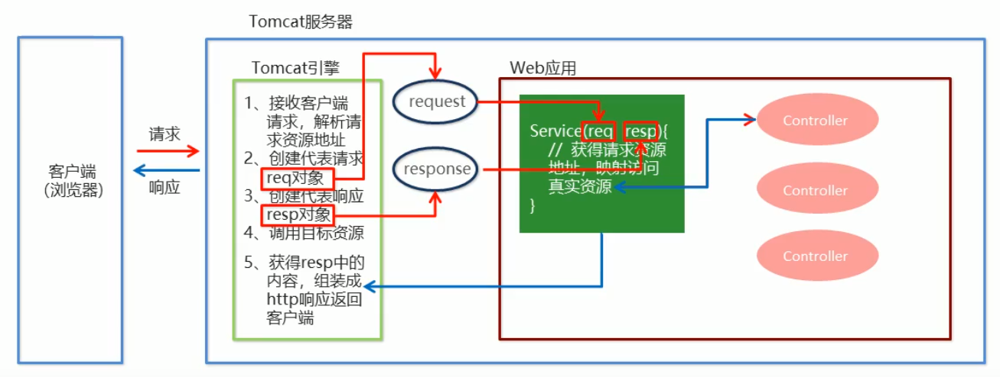
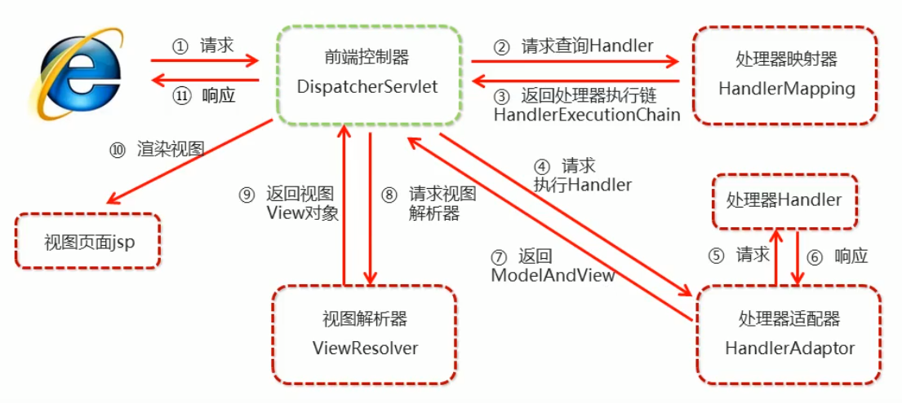

# Spring MVC

### spring-mvc簡介

#### 概述

Spring MVC 是一種基於 Java 實現 **MVC設計模型**的請求驅動類型的**輕量級Web框架**，屬於 Spring FrameWork 的後續產品，已經融合在 Spring Web Flow 中。

+ Spring MVC 隨著 Spring3.0 的發布，全面超越 Struts2。成為**最優秀的 MVC 框架**。
+ 通過一套**MVC註解**，讓一個簡單的Java類成為處理請求的控制器，無須實現任何接口。
+ 支持 **RESTful 編程風格**的URL請求。
+ 採用鬆散耦合可插拔設計結構，比其他MVC框架更具擴展性和靈活性。

#### 快速入門

需求：客戶端發起請求，服務端接收請求，執行邏輯並進行視圖跳轉

開發步驟：

1. 導入 `spring-webmvc` 依賴

2. web.xml 配置 SpringMVC 前端控制器 `DispathcerServlet`

   `DispatcherServlet` 就是一個 Servlet，配置與一般 Servlet 無異。需要注意的是 `load-on-start`需要配置，因為需要在服務器啟動就創建前端控制器，這樣它才能在請求時進行調度工作。

   第二個需要注意的點是前端控制器的`url-pattern`配置，下面解釋`/`與`/*`的區別：

   + `/`：攔截所有請求，範圍較`/*`小，不攔截對JSP頁面的請求。
   + `/*`：攔截所有請求，包括`*.jsp`這種對頁面的請求，而這些應該是交給 tomcat 處理。

   可是前端控制配置`url-pattern`為`/`，還是無法.html等靜態文件，原因如下：

   > Tomcat服務器中也有web.xml配置，簡稱大xml。每個web項目中也有個web.xml配置，簡稱小xml。**<font color="ff0000">所有的小xml都會繼承大xml的設定，如果小xml設定與大xml衝突，則以小xml為主。</font>**
   >
   > 如果去翻閱大xml的內容，當中有個`DefaultServlet`的配置，它的用途是用來處理靜態文件，它的`url-pattern`也是 `/`，而在使用 SpringMVC 在配置前端控制器時的`url-pattern`也是 `/`，這就導致設定被**覆蓋**，前端控制器接收到靜態文件請求時，會去找是否有與該靜態文件名稱相同的`@RequestMapping`註記方法來處理，因為根本沒有這個東西，所以異常發生。問題在之後會有解決辦法。
   >
   > 那為什麼JSP文件的請求可以呢？查看大xml，可以找到`JspServlet`配置它的`url-pattern`為`*.jsp`，用來負責處理JSP，前端控制器的`url-pattern`沒有與其衝突，`*.jsp`請求還是由`JspServlet`處理，這就是JSP可以正常請求的原因。
   >
   > **而當你將前端控制器的`url-pattern`設置為`/*`時，它的優先級是最高，所以`/`與`*.jsp`的請求都會被前端控制器接收到，所有的靜態文件與JSP請求都會有問題。**

   > 配置 `DispathcerServlet`時，需要配置初始化參數 `contextConfigLocation` 目的是指定SpringMVC 的配置文件的位置。Spring 的配置文件最好與 SpringMVC 分開，方便以後做維護。
   > <font color="FF0000">如果不配置初始化參數，Spring MVC 會去找 WEB-INF 資料夾底下檔名為的 前端控制器名-servlet.xml檔案。 </font>

3. 編寫 `controller` 類和 `view`

   `controller` 類中方法返回值如果為`String`，Spring 會自動`forward`到**指定路徑**下的視圖。

   > 需要注意相對位址與絕對位址的書寫，根目錄("/") 相當於webapp資料夾。

4. 使用註解配置 `controller` 類中業務方法的映射地址(`url pattern`)

   使用`@Controller`註解將類加入Spring容器管理，`@RequestMapping`註解在方法上指定`url-pattern`

5. 配置 SpringMVC 核心配置文件 spring-mvc.xml

   > 配置組件掃描時，建議只掃描`controller`類所在包下的。不要一併掃描`dao`、`service`，因為那是屬於 Spring 配置的領域。SpringMVC 配置只做有關於 SpringMVC 的配置就好。

6. 客戶端發起請求並測試

#### 快速入門範例

+ maven 依賴

  ```xml
  <dependency>
      <groupId>org.springframework</groupId>
      <artifactId>spring-webmvc</artifactId>
      <version>5.3.5</version>
  </dependency>
  ```

+ web.xml

  ```xml
  <?xml version="1.0" encoding="UTF-8"?>
  <web-app xmlns="http://xmlns.jcp.org/xml/ns/javaee"
           xmlns:xsi="http://www.w3.org/2001/XMLSchema-instance"
           xsi:schemaLocation="http://xmlns.jcp.org/xml/ns/javaee http://xmlns.jcp.org/xml/ns/javaee/web-app_4_0.xsd"
           version="4.0">
      <!-- 配置初始化參數 -->
      <context-param>
          <param-name>contextConfigLocation</param-name>
          <param-value>classpath:applicationContext.xml</param-value>
      </context-param>
  
      <!-- 配置監聽器 -->
      <listener>
          <listener-class>org.springframework.web.context.ContextLoaderListener</listener-class>
      </listener>
  
      <!-- 配置spring mvc 前端控制器 -->
      <servlet>
          <servlet-name>dispatcherServlet</servlet-name>
          <servlet-class>org.springframework.web.servlet.DispatcherServlet</servlet-class>
          <!-- 配置局部初始化參數，目的告知spring mvc 配置文件位置 -->
          <init-param>
              <param-name>contextConfigLocation</param-name>
              <param-value>classpath:spring-mvc.xml</param-value>
          </init-param>
          <!-- 服務器啟動時就載入 -->
          <load-on-startup>1</load-on-startup>
      </servlet>
      <servlet-mapping>
          <servlet-name>dispatcherServlet</servlet-name>
          <!-- url-pattern配置"/"，攔截所有請求，spring mvc 前端控制器會根據註解進行 forward 			/*和/都是攔截所有請求，但是/*的範圍更大，它會攔截到對*.jsp的請求，所以配置 / 就好
  -->
          <url-pattern>/</url-pattern>
      </servlet-mapping>
  </web-app>
  ```

+ spring-mvc.xml

  ```xml
      <!-- 配置組件掃描(只掃controll包)-->
      <context:component-scan base-package="org.learning.controller"/>
  ```
  
+ UserController

  ```java
  @Controller
  public class UserController {
      @Autowired
      UserService userService;
  
      //處理請求的 url-pattern
      @RequestMapping("/user")
      public String doSave(){
          System.out.println("execute userController");
          userService.doSave();
          // 視圖的名稱，/表示項目的根目錄
          return "/success.jsp";
      }
  }
  
  ```
  
+ success.jsp

  ```jsp
  <%@ page contentType="text/html;charset=UTF-8" language="java" %>
  <html>
  <head>
      <title>Hello</title>
  </head>
  <body>
      <h1>Hello SpringMVC</h1>
  </body>
  </html>
  ```

#### 前端控制器處理簡易流程



### 解決靜態文件請求404問題

快速入門中解釋了請求靜態文件(JSP除外)都會出現404的原因，spring-mvc 提供了解決方案，<font color="ff0000">可以在spring-mvc配置文件中告訴前端控制器，將無法處理的請求交由tomcat默認的Servlet處理，不要由前端控制器強行處理。</font>

操作步驟：

1. 配置文件引入 mvc 命名空間
2. 配置 `<mvc:default-servlet-handler>`，標註前端控制器無法處理的請求交由tomcat默認的來處理
3. 配置 `<mvc:annotation-driven>`，開啟註解驅動(必須)

範例：

```xml
    <!-- 配置組件掃描 -->
    <context:component-scan base-package="org.learning.controller">
    <!-- 開啟註解驅動 -->
    <mvc:annotation-driven/>
    <!-- 處理靜態資源 -->
    <mvc:default-servlet-handler/>
```

> spring-mvc 配置時，這三項為最基礎的配置

### @RequestMapping 註解解析

`@RequestMapping`

+ 作用：將請求url地址、Http請求方式(post、get …)、請求參數、請求頭等，映射到唯一的控制器方法上。

+ 使用位置

  + 類上：請求URL的一級訪問目錄，相當於**設置該類下所有方法的基準路徑**。此處不寫的話，相當於應用的根目錄。
  + 方法上：請求URL的二期訪問目錄，相當於**設置該方法的訪問路徑**。會與類上設定的基準路徑一起組成完整的訪問路徑。

   例如以下要訪問以下的`doSave`方法需要使用`/user/save`

  > 不論是類還是方法上的`@RequestMapping`，都可以去掉開頭`/`，SpringMVC還是會為你加上。
  > **建議`@RequestMapping`開頭都以`/`開頭**

  ```java
  @Controller
  @RequestMapping("/user")
  public class UserController{
  	@RequestMapping("/save")
      public void doSave(){
          // dosomething...
      }
  }
  
  /**
   * 如果方法上開頭少了/，類上指定/user，那你覺得要如何訪問該方法呢?
   * 1. /usersave
   * 2. /user/save 
   * 答案是 /user/save，因為 @RequestMapping 指定的是每層的路徑。
   * SpringMVC 會自動幫你加上 "/"，如果你的類、方法不以 "/" 作為開頭的話
   */
  @Controller
  @RequestMapping("/user")
  public class UserController{
  	@RequestMapping("save")
      public void doSave(){
          // dosomething...
      }
  }
  ```

+ 屬性

  + value：指定請求url。
  
    > 當傳給註解的屬性值為value，且只有這一個時，`value=`可以省略，所以直接寫在`@RequestMapping`括號中的`url-pattern`，就是指定`value`屬性的值。
    > 當需要指定多個屬性時，那麼`value=`就不可指定。多個屬性間用`,`分開。
  
  + method：用於**限定http請求的方式**。值為`RequestMethod`類型。
  
    ```java
    /*
     * 使用method屬性限定該方法只能接受POST方式的請求
     */
    @RequestMapping(value="/user", method = RequestMethod.POST)
    public String doSave(){
        System.out.println("execute userController");
        userService.doSave();
        return "success.jsp";
    }
    ```
  
    
  
  + params：**限定請求傳遞的參數**。它支持簡單的表達式，要求請求參數的key和value必須一致。
    + `params={"accountName"}` 表示請求參數**必須有** `accountName`
    
    + `params={"!accountName"}` 表示請求參數**不能有** `accountName`
    
    + `params={"money=100"}` 表示請求參數中`money`值是100
    
    + `params={"money!=100"}` 表示請求參數中`money`值不能是100或沒有`money`參數
    
      > `/update?abc=123` 此時username的值為 null
      >
      > `/update?username=` 此時username的值為空字串
    
  + path：與value屬性相同作用。
  
  + headers：規定請求頭，和`params`一樣，可以寫簡單的表達式。例如可以通過`User-Agent`限制訪問的瀏覽器
  
  + consumes：只接收內容類型是哪種類型的請求，規定**請求頭**中的`Content-Type`
  
  + produces：告訴瀏覽器返回的內容類型是什麼，相當於給**響應頭**加上`Content-Type`

#### Ant風格的資源地址

Ant 為古老的構件工具，它能通過一些符號來模糊比對硬碟中的資源。Spring 也借鏡了它優點，將它使用到**`url-pattern`的模糊比對**。

Ant通配符號有以下幾種：

+ ?：能替代任意**一個**字符

+ *：能替代0~N個字符或一層路徑。

+ **：能替代0~N層路徑。

  > 當一個請求同時符合多個`url-pattern`模糊比對時，採用相對嚴格那個。

範例：假設項目為springmvc

+ `/test01`：精確路徑，只能匹配 `/spring/test01`
+ `/test0?`：能將`?`替換為任意字元，不匹配`/spring/test0`(沒有字元)、`/spring/test111`(超過一個)
+ `/test0*`：可以將`*`替換為0~N個字元，但是不匹配`/test00/hello`(路徑)
+ `/a/*/c`：可以將`*`替換為N個字元，但是不能省略該層路徑。例如：不匹配`/a/c`或`/a//c`
+ `/a/**/z`：可以將`**`替換為0~N層路徑。例如：`/a/z`或`/a/b/c/z`。

#### @PathVariable

帶占位符的 URL 是 Spring 3.0 新增的功能，該功能在 spring-mvc 向 REST 目標挺進發展過程中具有里程碑的意義。

`@PathVariable` 可以將 URL 中占位符參數綁定到 controller 方法的形參中。URL 中的 {xxx} 占位符可以綁定通過 `@PathVariable("xxx")` 綁訂到方法形參中。

``` java
/**
 * 測試路徑上占位符獲取
 */
@RequestMapping("/user/{name}")
public String mapping03(@PathVariable("name") String name){
    System.out.println("mapping03 working...");
    System.out.printf("URL占位符為: %s", name);
    return "/success.jsp";
}
```

> 路徑上的佔位符只能占一層路徑，且該層不能被省略

#### REST思想

REST 是 Representational State Transfer 的縮寫。可譯為「具象狀態傳輸」。REST是一種軟體架構風格，目的是幫助在世界各地不同軟體、程式在網際網路中能夠互相傳遞訊息。任何東西都可以視為資源(Resource)，用來唯一標示網際網路上的資源使用的是 URL，而使用者的請求無非就是獲取資源或改變資源的狀態。

在最初HTTP誕生時，REST就跟著問世了，對資源進行的操作與HTTP請求的方式相互呼應。

+ <font color="ff0000">GET：讀取資源</font>
+ <font color="ff0000">PUT：替換資源</font>
+ PATCH：替換資源部分內容
+ <font color="ff0000">DELETE：刪除資源</font>
+ <font color="ff0000">POST：新增資源</font>
+ OPTIONS：回傳該資源所資源的 HTTP 請求方式
+ CONNECT 將連接請求轉換至 TCP/IP 隧道

使用HTTP來表達語意的路由設計風格稱為 RESTful API，以「資源」為中心，在搭配 HTTP method 的動詞，以及 CRUD 等資料操作。

對資料的操作，不外乎是：新增(Create)、讀取(Read)、更新(Update)、刪除(Delete)四種動作，通常會簡稱為 CRUD。而HTTP method 是有意義的動詞，如GET、PUT、DELETE、POST等。

固定的結構是：

- 瀏覽全部資料：GET + 資源名稱
- 瀏覽特定資料：GET + 資源名稱 + :id
- 新增一筆資料：POST + 資源名稱
- 修改特定資料：PUT + 資源名稱 + :id
- 刪除特定資料：DELETE + 資源名稱 + :id

下面是有無使用REST思想來構建API的區別：

``` java
// no REST API
/getBooks?id=1 //取得id=1的書籍資料
/updateBooks?id=1&name=HelloWorld //更新id=1的書籍
/insertBook?name=JAVA8&auth=Peter //新增一本書，書籍訊息就是參數值
/deleteBooks?id=1 // 刪除id=1的書籍
// RESTful API
/books/1 //使用GET方式 表示取得id=1的書籍
/books/1?name=HelloWorld //使用PUT方式，表示更新id=1的書籍
/books?name=JAVA&auth=Peter //使用POST方式 表示新增一本書
/books/1 //使用DELETE方式 表示刪除id=1的書籍
```

看完上面的差異，可以發現REST的URL更好理解，也很有規律。當然不可能所有的請求都能完美對齊 RESTful。例如；登入通常設定為`PUT/login`，完全是以動詞為中心。身為開發者，有時候還是須因地制宜，風格只是參考，不是阻礙。

> 從網址上，你會看出要操作的資源叫做 **books**，這邊習慣用複數名詞。

#### Spring 對 REST 的支持

在頁面上不通過 Ajax，只能發送`PUT`、`POST`請求。spring-mvc 提供 `HiddenHttpMethodFilter`，它可以把POST請求轉化為其他HTTP請求方式。

操作步驟：

1. 配置 Filter

   ``` xml
   <filter>
       <filter-name>hiddenHttpMethodFilter</filter-name>
       <filter-class>org.springframework.web.filter.HiddenHttpMethodFilter</filter-class>
   </filter>
   <filter-mapping>
       <filter-name>hiddenHttpMethodFilter</filter-name>
       <url-pattern>/*</url-pattern>
   </filter-mapping>
   ```

2. 發起請求

   發起請求時必須依照以下要求

   1. 建立一個使用 POST 方式的表單。
   2. 請求發送時攜帶一個`_method`的參數。
   3. `_method`的值就是 HTTP 請求方式。例如：DELETE、PUT。

#### Tomcat8以上JSP無法接受PUT、DELETE解決方式

當web容器為Tomcat 8 以上，設計RESTful API 時，會發現通`HiddenHttpMethodFilter` 過濾器轉換後確實可以讓後端控制器方法接收到 `PUT`、`DELETE` 方式請求，但是處理完請求還是會使用 `PUT`、`DELETE` 方式轉發到JSP頁面時，Tomcat 會因為無法處理 `PUT`、`DELETE` 而出現異常。

目前有4種方法解決：

1. 使用 Tomcat7：沒有實質解決問題

2. 設置目標頁面為錯誤頁面：錯誤訊息會被封裝在JSP內置物件error中，所以看不到轉發錯誤訊息。還是出現錯誤了，沒有根本解決問題。

   ``` jsp
   <%@ page isErrorPage="true" %>
   ```

3. 使用重定向(Redirect)：可以在控制器方法的字串返回值加上前綴 `redirect:`，指定使用重定向。

4. 使用`@ResponseBody`：在負責處理`PUT`、`DELETE`請求的控制器方法加上該註解，但只能返回方法返回值，無法進行轉發。

### 請求處理

#### 處理請求參數

假設請求的 URL `http:localhost:8080/springmvc/books?name=Java8`。從URL得知 username 請求參數 ，其值為 Java8。

獲取請求參數有以下方式：

1. spring-mvc 默認的方式：

   直接在控制器的方法加上與請求參數同名的方法參數。當沒有該請求參數時，方法參數值為 `null`。

   ```java
   @RequestMapping(value = "/books", method = RequestMethod.POST)
   public String insertBook(String username) {
       System.out.println("username: " + username);
       System.out.println("insertBook working");
       return "/success.jsp";
   }
   ```

2. `@RequestParam`

   1. 作用：獲取對應的請求參數值
   2. 使用位置：方法形參
   3. 屬性：
      1. value：指定請求參數的值
      2. required：這個參數是否為必須的。默認值為`true`
      3. defaultValue：當沒有該請求參數時，設置其默認值。默認值為`null`。

   ``` java
   /**
    * 註解可以讓請求參數與方法形參不同名稱，且可以指定默認值
    */
   @RequestMapping(value = "/books", method = RequestMethod.POST)
   public String insertBook(
       @RequestParam( value = "username", required = false, defaultValue = "Peter") String name) {
       System.out.println("username: " + name);
       System.out.println("insertBook working");
       return "/success.jsp";
   }
   ```

   > 當 required 默認是 true，且沒有該請求參數時，會出現異常

#### 處理請頭

+ `@RequestHeader`

  + 作用：用於獲取指定請求頭信息，可以取代之前的操作：`request.getHeader("User-Agent")`。

  + 使用位置：控制器方法形參

  + 屬性：

    + value：指定請求參數的值
    + required：指定請求頭是否必須存在，默認值為 `true`。
    + defaultValue：當沒有該請求 header 時，設置其默認值。預設默認值為`null`。

    ``` java
  @RequestMapping(value = "/books/{id}", method = RequestMethod.PUT)
    @ResponseBody
    public String updateBook(@PathVariable("id") String id, @RequestHeader("User-Agent") String userAgent) {
        System.out.println("瀏覽器訊息：" + userAgent);
        System.out.println("updateBook working");
        System.out.println("books id is " + id);
    
        return "/success.jsp";
    }
    ```
  
    > 當 required 屬性值為 true 但是 請求頭不存在時，`MissingRequestHeaderException` 異常


#### 處理Session

+ `@SessionAttrubute`

  + 作用：獲取 `session` 域中存放的屬性值。

  + 使用位置：方法形參

  + 屬性：

    + value：指定 session 域中屬性的 key 值
    + required：session 屬性是否為必須存在，預設默認值為`true`。

    ```java
    @RequestMapping("/test05")
    public String test05(@SessionAttribute("hello") String attr){
        System.out.println(attr);
        return "/success.jsp";
    }
    ```
  

#### 處理請求 Cookie

+ `@CookieValue`

  + 作用：獲取請求 cookie 值。

    ``` java
    // javaWeb時獲取 cookie 操作
    Cookie[] cookies = request.getCookies();
    for(Cookie c : cookies){
        if(c.getName().equals("JSESSIONID")){
            String value = c.getValue();
        }
    }
    ```
    
  + 使用位置：方法形參
  
  + 屬性：
    
      + value：請求 cookie 的 key。
      + required：cookie 是否為必須，默認值為`true`。
    + defaultValue：當沒有該 cookie 時，給定其默認值。預設默認值為`null`。
  
  ``` java
  @RequestMapping(value = "/books/{id}", method = RequestMethod.PUT)
  @ResponseBody
  public String updateBook(@CookieValue("JSESSIONID") String jid) {
      System.out.println("updateBook working");
      System.out.println("SESSION值: " + jid);
  
      return "/success.jsp";
  }
  ```

#### 封裝請求參數為POJO對象

請求參數較少時，使用 `@requestParam` 非常方便；當請求參數數量非常多時，使用 `@requestParam` 來一個個獲取請求參數，不只麻煩，還會讓方法參數過多。常見的處理方式就是將請求參數歸類並封裝為POJO物件。

spring-mvc 有自動封裝請求參數為相應的對象功能，**它會嘗試映射同名的請求參數值到Java對象中同名的屬性中**，而那些沒有映射到的屬性就維持其原值。

假設有以下表單要提交：

``` html
<form method="post" action="/books">
    書籍訊息：<br>
    書名：<input type="text" name="bookName"><br>
    作者：<input type="text" name="author"><br>
    價格：<input type="text" name="price"><br>
    庫存: <input type="text" name="stock"><br>
    <hr>
    地址訊息：<br>
    郵遞區號：<input type="text" name="address.postalCode">
    城市： <input type="text" name="address.city">
</form>
```

注意表單中地址訊息中郵遞區號與城市`input`標籤的`name`屬性，如果地址的訊息是在另一個 POJO 物件中，且作為表單對應物件內的屬性 (`address`)，此時可以**通過 `.` 來表示屬性的屬性**， spring-mvc 能識別並自動封裝。

```java
public class Address {
    private String postalCode;
    private String city;
    // 以下省略getter、setter、toString方法
}

public class Book {
    private String bookName;
    private String author;
    private Double price;
    private Integer stock;
    Address address;
    
    // 以下省略getter、setter、toString方法
}
```

```java
/**
 * Spring mvc 自動封裝請求參數為POJO對象
 */
@RequestMapping(value = "/books", method = RequestMethod.POST)
public String insertBook(Book book) {
    System.out.println("book: " + book);
    System.out.println("insertBook working");
    return "/success.jsp";
}
```

### 原生API支持

Servlet 中，都是直接透過 `HttpServletRequest` 和 `HttpServletResponse` 物件獲得的請求訊息、進行請求的響應操作。

spring-mvc 中提供對**部分**原生 API 的支持，只要將原生 API 對象定義為方法形參，spring-mvc 在呼叫控制器方法時會傳入。

spring-mvc 所支持的原生API：

+ HttpServletRequest
+ HttpServletResponse
+ HttpSession
+ java.security.Principal：https安全協議
+ Locale：國際化有關的區域訊息
+ InputStream：`ServletInputStream is = request.getInputStream();`
+ OutputStream：`ServletOutputStream os = response.getOutputStream();`
+ Reader：`BufferedReader reader = resquest.getReader();`
+ Writer：`PriterWriter writer = response.getWriter();`

```java
@RequestMapping("/test01")
public String test01(HttpServletRequest req, HttpSession session){
    req.setAttribute("username", "James");
    session.setAttribute("username", "Peter");
    return "/success.jsp";
}
```

### 亂碼問題解決

回顧在 Servlet 時所學到的解決亂碼的方式，亂碼可以分為兩大類：

+ 請求亂碼

  + `GET` 請求

    解決方式：透過 tomcat 的 `server.xml` 設定文件，在8080端口處設置 `URLENCODEING="UTF-8"`

    > 高版本 Tomcat 內置設定 URLENCODEING 為 UTF-8

  + `POST` 請求

    解決方式：`request.setCharacterEncoding("UTF-8")`

+ 響應亂碼

  解決方式：`response.setContentType("text/html;charset=UTF-8")` 或 `response.setCharacterEncoding("UTF-8")`

Servlet 中，會將處理編碼問題使用 Filter 統一做處理，spring-mvc 也提供編碼處理的過濾器`CharacterEncodingFilter`。

`CharacterEncodingFilter` 屬性：

+ String encoding：編碼格式
+ boolean forceRequestEncoding：是否設置請求編碼格式，默認值為`false`。
+ boolean forceResponseEncoding：是否同時設置響應編碼格式，默認值為`false`。

```xml
<!-- 配置編碼處理Filter，需要配置在所有filter前面-->
<filter>
    <filter-name>characterEncodingFilter</filter-name>
    <filter-class>org.springframework.web.filter.CharacterEncodingFilter</filter-class>
    <init-param>
        <param-name>encoding</param-name>
        <param-value>utf-8</param-value>
    </init-param>
    <init-param>
        <param-name>forceRequestEncoding</param-name>
        <param-value>true</param-value>
    </init-param>
    <init-param>
        <param-name>forceResponseEncoding</param-name>
        <param-value>true</param-value>
    </init-param>
</filter>
<filter-mapping>
    <filter-name>characterEncodingFilter</filter-name>
    <url-pattern>/*</url-pattern>
</filter-mapping>
```

> 解決編碼的 Filter 必須配置到其他 Filter 最前面。

### spring-mvc 配置基本概念

spring-mvc 在工作時，關鍵位置都是通過調用9大組件來完成功能，它們分別是：

+ `MultipartResolver`：文件上傳解析器
+ `LocaleResolver`：區域訊息解析器
+ `ThemeResolver`：主題解析器
+ `HandlerMapping`：映射器
+ `HandlerAdapter`：適配器
+ `HandlerExceptionResolver`：異常解析器
+ `RequestToViewNameTranslator`：當方法沒有返回視圖名，會將請求url轉為試圖名
+ `FlashMapManager`：FlashMap是spring-mvc中運行重定向攜帶數據的功能
+ `ViewResolver`：視圖解析器

>  它們有一個共通點：全部都是接口

元件默認使用類都設定在`org.springframework.web.servlet`包下的`DispatcherServlet.properties`文件中。可以通過配置讓 spring-mvc 不使用默認的類，改變 spring-mvc 的行為。

以配置視圖解析器為例：

+ `InternalResourceViewResolver`為默認的視圖解析器，它的父類`UrlBasedViewResolver`有`prefix`和`suffix` 兩個成員變量。通過配置這兩個變量的值，它會將控制器方法返回的視圖名稱加上前後墜。

### 數據的響應

#### 數據響應方式

spring-mvc 響應數據的方式非常多，除了在原生API章節中直接操作原生API進行響應之外，還有幾種方式。

+ 頁面跳轉
  + 方法返回視圖名
  
    > 視圖名稱和視圖解析器中的前後綴拼成一個完整的頁面路徑
+ 傳回數據
  
  + 控制器方法傳入Map、Model、ModelMap對象

#### 頁面跳轉-方法返回視圖名

視圖名會與與視圖解析器 `ViewResolver` 中的前後綴拼串成完整頁面路徑，spring-mvc 使用頁面路徑進行跳轉。

範例：視圖名稱為 `index`視圖名稱和配置前後綴拼接起來為 `/WEB-INF/index.jsp`。

```xml
<property name="prefix" value="/WEB-INF/jsp/" />
<property name="suffix value=".jsp" />
```

可以在 spring-mvc 配置視圖解析器 bean，預設的視圖解析器是 `org.springframework.web.servlet.view.InternalResourceViewResolver`，spring-mvc 各預設組件都可以從 `spring-webmvc` 依賴中的 `org.springframework.web.servlet` 包下的 <font color="ff0000">DispatcherServlet.properties</font> 文件找到

#### 傳回數據

控制器方法中指定傳入`Map`、`Model`、`ModelMap` 參數，操作物件進行添加鍵值對或屬性方式，spring-mvc 會將添加的數據設置為 `request` 域的屬性。

```java
/**
 * 傳入Map方式
 */
@RequestMapping("/test01")
public String test01(Map<String,Object> resultMap){
    System.out.println("test01 is working");
    resultMap.put("username", "Jessy");
    return "/success.jsp";
}

/**
 * 傳入Model方式
 */
@RequestMapping("/test02")
public String test02(Model model){
    System.out.println("test02 is working");
    model.addAttribute("username", "Tommy");
    return "/success.jsp";
}

/**
 * 傳入 ModelMap 方式
 */
@RequestMapping("/test03")
public String test03(ModelMap modelMap){
    System.out.println("test03 is working");
    modelMap.addAttribute("username", "Brian");
    return "/success.jsp";
}
```

#### Map、Model、ModelMap的關係

查看三者的 class 可以發現 spring-mvc 都是傳入同一個 `BindingAwareModelMap` 對象。spring-mvc 只是將相同的物件以多態的方式賦值給不同的變數。

```java
/**
 * 同時傳入三個，其實都是傳入BindingAwareModelMap對象
 * 且3個都是使用同樣的對象
 */
@RequestMapping("/test04")
public String test04(Map<String, Object> map, Model model, ModelMap modelMap){
    //org.springframework.validation.support.BindingAwareModelMap
    System.out.println(map.getClass());
    //org.springframework.validation.support.BindingAwareModelMap
    System.out.println(model.getClass());
    //org.springframework.validation.support.BindingAwareModelMap
    System.out.println(modelMap.getClass());

    System.out.println(map == model); //true
    System.out.println(model == modelMap);//true
    return "/success.jsp";
}
```

三者之間的關係如下：(i)為interface、(c)為class，階層為繼承關係

+ Map(i)
  + LinkedHashMap(c)
    + ModelMap(c)
      + ExtendedModelMap(c) implement Model
        + BindingAwareModelMap(c)
+ Model(i)

#### 頁面跳轉及傳回數據 - 返回 ModelAndView 對象

`ModeAndView` 顧名思義，由Mode(模型)和View(視圖)組成。模型保存數據，視圖展示數據。

常用得方法如下：

+ setViewName(String name) 設置視圖名，與控制器方法直接回傳視圖名相同效果。
+ addObject(String attributeName, Object attributeValue)  設置`Model`中保存的數據為 `request` 域中屬性

##### 範例一：手動創建 ModelAndView 對象

```java
/**
 * 頁面跳轉 - 返回ModeAndView方式
 */
@RequestMapping("/delete")
public ModelAndView doDelete(){
    ModelAndView modelAndView = new ModelAndView();
    // 設置要跳轉的視圖路徑位置
    modelAndView.setViewName("/success.jsp");
    // 設置模型數據
    modelAndView.addObject("username","James");
    System.out.println("delete running");
    return modelAndView;
}
```

##### 範例二：方法傳入ModelAndView 對象

```java
/**
 * 方法傳入ModelAndView 對象
 */
@RequestMapping("/update")
public ModelAndView doUpdate(ModelAndView modelAndView){
    // 設置Model數據
    modelAndView.addObject("username","Tommy");
    // 設置視圖名
    modelAndView.setViewName("/success.jsp");
    return modelAndView;
}
```

#### SESSION 域中帶入數據

spring-mvc 也提供放入 `session` 域中的方法，註解使用上沒有這麼的直覺。**<font color="ff0000">建議直接使用原生API方式</font>**。

+ `@SessionAttributes`

  + 作用：將欲存放在 `request` 域中的模型數據(BindingAwareModelMap、ModelAndView)也存放一份至 `session` 域中。

  + 使用位置：控制器類

  + 屬性：

    + value：指定`request`域中的key值。
    + type：限定屬性值的類型

  + 範例

    ```java
    @Controller
    @RequestMapping("/return")
    @SessionAttributes(value = "username")
    public class ReturnValueController {
        @RequestMapping("/test06")
        public String test06(Model model){
            model.addAttribute("username", "HelloWorld");
            return "/success.jsp";
        }
    }
    ```

    > @SessionAttribute 和 @SessionAttribute<font color="ffoooo">s</font> 是兩個不同的註解，請不要搞混

#### @ModelAttribute 

`@ModelAttribute` 註釋可以為模型添加數據。`@ModelAttribute` 通常是和 `@RequestMapping` 一起配合使用，`@ModelAttribute` 和 `@RequestMapping` 註釋位置的不同，其作用也有所差異。

在執行控制器類下的被 `@RequestMapping` 註解標註的方法前，spring-mvc 會依次執行被 `@ModelAttribute` 標註的方法。範例：當 login 請求到來時，會先呼叫 preProcess 方法，在呼叫 doLogin 方法。

```java
@RequestMapping("/login")
public String doLogin(){
    return "/success.jsp";
}

@ModelAttribute
public void preProcess(){
    System.out.println("Welcome ...")
}
```


`@ModelAttribute`註解標註的方法返回值會被存放在`Model`中，註解的 value 屬性設置方法返回值在 `Model` 的 key 值。沒有指定時以返回值類型名稱為 key (駝峰命名方式)。

範例：在執行 doLogin 方法前，執行 preProcess 方法，該方法讀取請求參數 username 和 password 值，並將其封裝為 User 物件，存放在 `Model `中，key 值為 `currentUser`。

```java
@RequestMapping("/login")
public String doLogin(){
    return "/success.jsp";
}

// 如果沒有指定 value，那該例子的 key 為 user
@ModelAttribute("currentUser")
public User preProcess(@RequestParam("username") username, @RequestParam("password") password){
    System.out.println("Welcome " + username);
    User user = new User(username, password);
    return user;
}
// 或是使用這種方式指定 key 值，效果與上面方法一致
@ModelAttribute
public void preProcess(@RequestParam("username") username, @RequestParam("password") password, Model model){
    System.out.println("Welcome " + username);
    User user = new User(username, password);
    model.addAttribute("current-user", user);
}
```

使用在方法形參上的 `@ModelAttribute` 註解的作用就是獲取 `Model` 中存放的數據。

1. 首先會決定到`Model`中取得數據的key值，如果`@ModelAttribute`有指定value值，key使用value，如果沒有指定value，則以參數的類型名稱作為 key(小寫開頭)。
2. 使用key值到`Model`(隱含模型)中獲取數據，如果有數據，則將該數據賦值給參數；如果沒有，則創建一個新的物件賦值給該參數。

```java
// 從Model中有 "currentUser"，所以重新創建User對象，而是使用 "currentUser" 進行請求參數的封裝
@RequestMapping("/login")
public String doLogin(@ModelAttrubute("currentUser") User user){
    System.out.printf("welcome %s", user.getUsername());
    return "/success.jsp";
}

// 如果沒有指定 value，那該例子的 key 為 user
@ModelAttribute("currentUser")
public User preProcess(@RequestParam("username") username, @RequestParam("password") password){
    User user = new User(username, password);
    return user;
}
```

如果 `Model` 中不存在指定 key 值的物件，那麼 spring-mvc 會使用原本的方式重新創建物件，並封裝。只是最後它還會將該物件放入到 `Model ` 中，key 值為 value 值。

```java
// Model中沒有"currentUser"，創建User並使用它來封裝請求參數，最後以 "currentUser"字串為key，將該物件保存在Model中
@RequestMapping("/login")
public String doLogin(@ModelAttrubute("currentUser") User user){
    System.out.printf("welcome %s", user.getUsername());
    return "/success.jsp";
}

//然後可以在JSP頁面取值
<h1>Hello ${currentUser.name}<h1>
```

`@RequestMapping` 和 `@ModelAttribute` 同時註釋同一個方法。

此時該方法的返回值不在表示視圖名，取而代之的是 `@RequestMapping` 的value 成為視圖名。方法的返回值則變成存放在 `Model` 中的數據，`@ModelAttribute` 的 value 值則為該數據的 key。

```java
// 返回的視圖名稱是 login
@RequestMapping("/login")
@ModelAttrubute("currenUser")
public User doLogin(@RequestParam("username") username, @RequestParam("password") password){
    User user = new User(username, password);
    return user;
}
```

`@RequestMapping` 所修飾的方法返回值上使用 `@ModelAttribute `修飾，此時方法返回值不再表示視圖名，取而代之的是 `@RequestMapping` 的value 成為視圖名。方法的返回值則變成存放在 `Model` 中的數據，`@ModelAttribute` 的 value 值則為該數據的 key。

```java
// 返回的視圖名稱是 login
@RequestMapping("/login")
public @ModelAttrubute("currenUser")User doLogin(@RequestParam("username") username, @RequestParam("password") password){
    User user = new User(username, password);
    return user;
}
```

總結：`@ModelAttribute` 適合為其它 `@RequestMapping` 修飾的方法在 `request` 域中設置共用的數據，這樣就不必在每個控制器方法中重複書寫在`Model`設置共用數據的操作。

### 視圖解析器-進階

方法返回值為視圖名時，視圖解析器就跟將該視圖名拚上前後綴組成完整的頁面路徑。

還可以透過`forward:`和`redirect:`的形式指定頁面跳轉的方式，<font color="ff0000">當顯示的指定跳轉的方式時，視圖解析器不會拼上前後綴，而是直接使用。</font>

Servlet 能將請求轉發(forward)到另一個 Servlet 做處理，`forward:` 後面只要接上對應請求路徑，也可以做到相同的效果。

Servlet 在進行重定向(redirect)請求時，`/` 代表的是web應用所在伺服器，因為重定向操作是由瀏覽器進行的，它只認識伺服器，所以你會需要加上web應用的名稱，例如：`reponse.sentRedirect("/spring-mvc/test01")`。<font color="ff0000">使用 `redirect:` 指定轉發方視時，spring-mvc 會自動幫你帶上web應用的名稱，所以`/`表示的是當前web應用的根目錄</font>，例如：`"redirect:/test01"` 可以達到與上面Servlet重定向一樣的效果。

範例：

```java
// 指定跳轉到 webContent資料夾下的success.jsp
@RequestMapping("/test01")
public String test01(){
    return "forward:/success.jsp"
}

// 還可以處理完後，在forward到另一個控制器方法
// 先轉發到/test01，最後到 success.jsp 頁面
@RequestMapping("/test02")
public String test02(){
    return "forward:/test01"
}
```

#### 源碼分析出的結論

1. IOC容器內如果有配置視圖解析器，就使用所有有配置的視圖解析器(不只能配置一個)。
2. 所有控制器的方法返回值，最終都會封裝成`ModelAndView`對象
3. 視圖解析器功能就是解析視圖名稱，得到View對象
4. 視圖解析器得到View(視圖)的流程就是，嘗試執行**每個**視圖解析器解析視圖名稱，如果解析失敗，就嘗試下一個視圖解析器，直到有一個成功為止。
   1. 下面是 `InternalResourceViewResolver`視圖解析器的流程(不是所有視圖解析器都是這麼工作的，你也可以自訂視圖解析器)
   2. 如果有指定跳轉方式`forward:`，解析會得到 `InternalResourceView`對象
   3. 如果有指定跳轉方式 `redirect:`，解析後得到``RedirectView`對象
   4. 如果沒有指定跳轉方式，解析後得到 `InternalResourceView`，所以<font color="ff0000">當使用`InternalResourceViewResolver`視圖解析器，在不指定頁面跳轉方式時，默認是採用`forward`方式進行跳轉頁面操作。</font>
5. 調用View對象進行渲染時，`Model`(隱含模型)中數據會被放入到 `requset`域中(此為`InternalResourceView`的操作，其他View對象可能會不同)。
6. 調用View對象進行渲染時，會決定頁面路徑，最後進行頁面跳轉操作。

> 視圖解析器的功能只是為了得到視圖對象，而具體的渲染是視圖的工作。

#### 常用的視圖解析器實現類

| 大類             | 視圖類型                     | 說明                                                         |
| ---------------- | ---------------------------- | ------------------------------------------------------------ |
| 解析為Bean的名子 | BeanNameViewResolver         | 將邏輯視圖名解析為一個Bean：邏輯視圖名到IOC容器中找一個視圖對象。 |
| 解析為URL文件    | InternalResourceViewResolver | 將視圖名解析為一個URL文件，一般使用該視圖解析器將視圖名映射為web應用下的文件(如JSP) |
| 解析為URL文件    | JasperReportsViewResolver    | JasperReports 是基於 Java 的開源報表工具，該解析器將視圖名稱解析為報表文件對應的 URL |
| 模板文件視圖     | FreeMakerViewResolver        | 解析基於 FreeMaker 模板技術的模板文件                        |
| 模板文件視圖     | VelocityViewResolver         | 解析基於 Velocity 模板技術的模板文件                         |
| 模板文件視圖     | VelocityLayoutViewResolver   |                                                              |

+ 開發者可以選擇一種視圖解析器或混用多種視圖解析器
+ 每個視圖解析器都實現了Ordered接口並開放出一個order屬性，<font color="ff0000">可以通過order屬性指定視圖解析器的優先順序，order越小優先度越高。</font>
+ spring-mvc 會按照視圖解析器順序的優先順序對邏輯是圖名進行解析，直到成功返回視圖對象為止，否則將會拋出`ServletException`

### 視圖

視圖的作用是渲染模型數據，將模型裡的數據以某種形式呈現給客戶，轉發與重定向只是比較基礎的兩種方式而已。

視圖對象由視圖解析器負責實例化。由於視圖是<font color="ff0000">無狀態</font>的，所有不會有線程安全問題。

#### 常用的視圖實現類

| 類型               | 視圖                         | 說明                                                         |
| :----------------- | ---------------------------- | ------------------------------------------------------------ |
| URL資源<br />視圖  | InternalResourceView         | 將JSP或其他資源封裝為一個視圖<br />，是`InternalResourceViewResolver`<br />默認使用的視圖實現類。 |
| URL 資源<br />視圖 | JstlView                     | JSP頁面中如果使用JSTL國際化標籤的功能，<br />需要使用該視圖類。 |
| 文檔視圖           | AbstractExcelView            | Excel文檔視圖的抽象類。該視圖類基於POI<br />構建Excel文件    |
| 文檔視圖           | AbstractPdfView              | PDF文檔視圖的抽象類，該視圖基於iTexte<br />構建PDF文檔       |
| JSON視圖           | MappingJacksonJsonView       | 將模型數據通過Jackson開源框架的<br />ObjectMapping以JSON方式輸出 |
| 報表視圖           | ConfigurableJsperReportsView | 幾個使用JsperReports報表技術的視圖                           |
| 報表視圖           | JsperReportsCsvView          |                                                              |
| 報表視圖           | JsperReportsMultiFormatView  |                                                              |
| 報表視圖           | JsperReportsHtmlView         |                                                              |
| 報表視圖           | JsperReportsPdfView          |                                                              |
| 報表視圖           | JsperReportsXlsView          |                                                              |

#### JstlView 支持便捷的國際化功能

只要你導入Jstl的依賴，spring-mvc 就會智能使用 JstlView 來處理頁面渲染。你也可以手動配置 `InternalResourceViewResovler`的`viewClass`屬性，指定使用`JstlView`全類名。

> 使用國際化，需確定資源文件(*.properties)、JSP頁面、資源管理器<font color="ff0000">編碼需一致</font>

##### 沒有使用JstlView，國際化的步驟：

1. Java
   1. 獲得一個`Locale`對象
   2. 使用`ResourceBundle`綁定國際化資源文件
   3. 使用`ResourceBundle.getString("key")`獲得國際化文件訊息
2. Web頁面
   1. JSP頁面引入標籤庫 `fmt`
   2. `<fmt:setLocale>` 設置區域
   3. `<fmt:setBundle>` 設置綁定資源文件
   4. `<fmt:message>` 取得國際化文件訊息

##### 使用JstlView步驟

1. 讓spring-mvc管理國際化資源文件：
   1. 在IOC容器配置資源文件管理器：`ResourceBundleMessageSource`
   2. <font color="ff0000">配置Bean的ID為 `messageResource`(必須使用該名稱)</font>
   3. 配置資源文件管理器屬性`basename`：指定基礎路徑
   4. 配置資源文件管理器屬性`defaultEncoding`：指定文件編碼
2. JSP頁面引入標籤庫 `fmt`
3. `<fmt:message>` 取得國際化文件訊息

> 想要使用JstlView一定要經過spring-mvc處理，如果該JSP頁面不是由spring-mvc跳轉處理，那就不會有效果。
>
> 例如：你直接在請求URL訪問WEB-INF外的`*.JSP`文件，會是由Tomcat配置的Servlet處理，所以沒有使用到JstlView。

範例：

i18n_en_US.properties

``` properties
welcome=WELCOME
user=USER
password=PASSWORD
login=LOGIN
```

i18n_zh_TW.properties

``` properties
welcome=歡迎光臨
user=使用者
password=密碼
login=登入
```

spring-mvc 配置文件

``` xml
<!-- 讓 spring-mvc 管理國際化資源文件，配置資源文件管理器 -->
<!-- id必須是 messageSource -->
<bean id="messageSource" class="org.springframework.context.support.ResourceBundleMessageSource">
    <!-- 指定基礎名稱 -->
    <property name="basename" value="i18n" />
    <!-- 指定文件編碼 -->
    <property name="defaultEncoding" value="UTF-8"/>
</bean>
```

JSP

``` jsp
<%@ page contentType="text/html;charset=UTF-8" language="java" %>
<!-- 引入fmt標籤庫 -->
<%@taglib prefix="fmt" uri="http://java.sun.com/jsp/jstl/fmt" %>
<html>
    <head>
        <title>i18n</title>
    </head>
    <body>
        <!-- 使用fmt:message取值 -->
        <h1><fmt:message key="welcome"/></h1>
        <form method="post" action="#">
            <fmt:message key="user"/> <input type="text">
            <fmt:message key="password"/><input type="text">
            <input type="submit" value="<fmt:message key="login"/>">
        </form>
    </body>
</html>
```

##### spring-mvc JstlView國際化的大坑：

1. JSP頁面不是由spring-mvc跳轉處理，那就不會有效果。
   例如：你直接在請求URL訪問WEB-INF外的`*.JSP`文件，會是由Tomcat配置的Servlet處理，所以沒有使用到JstlView。
2. 如果控制器方法指定跳轉方式 `forward:`、`redirect:`，那麼使用的視圖會是`InternalResourceView`和`RedirectView`，而不是使用`JstlView`，所以國際化會失效。

### view-controller 跳轉頁面

放在 WEB-INF 資料夾下的資源都無法直接獲取，必須透過`forward`的方式，在JavaWeb的階段，有些情況就僅僅需要轉發操作，使用spring-mvc，那可能會出現大量的以下類似代碼：

```java
@RequestMapping("/login")
public void doLogin(){
    return "/WEB-INF/pages/login.jsp";
}
```

接收到請求的同時，馬上轉發到另一個頁面，中間沒有任何業務邏輯，如果是這種需求 ，spring-mvc 提供了 `<mvc:view-controller>` 標籤解決該問題。

view-controller標籤屬性

1. path：請求的`url-pattern`(`@RequestMapping`的 value)
2. view-name：視圖名稱(方法的返回的視圖名稱)

步驟：

1. spring-mvc配置文件引入mvc命名空間

2. 配置`<mvc:view-controller>`標籤，指定請求與視圖名稱的映射

3. <font color="ff0000">開啟mvc註解驅動模式，使用`<mvc:annotation-driven>`標籤</font>，所有高級的spring-mvc功能都是基於該註解之上，所以相當於開啟spring-mvc的進階模式。

   > 沒有開啟mvc註解驅動，會導致其他頁面spring-mvc處理失效

4. 測試

範例：

```xml
<?xml version="1.0" encoding="UTF-8"?>
<beans xmlns="http://www.springframework.org/schema/beans"
       xmlns:xsi="http://www.w3.org/2001/XMLSchema-instance"
       xmlns:context="http://www.springframework.org/schema/context"
       xmlns:mvc="http://www.springframework.org/schema/mvc"
       xsi:schemaLocation="http://www.springframework.org/schema/beans http://www.springframework.org/schema/beans/spring-beans.xsd http://www.springframework.org/schema/context https://www.springframework.org/schema/context/spring-context.xsd http://www.springframework.org/schema/mvc https://www.springframework.org/schema/mvc/spring-mvc.xsd">
    <!-- 配置組件掃描 -->
    <context:component-scan base-package="org.learning.controller">

    </context:component-scan>
    <bean class="org.springframework.web.servlet.view.InternalResourceViewResolver">
        <property name="prefix" value="/WEB-INF/pages/"/>
        <property name="suffix" value=".jsp"/>
    </bean>

    <!-- 讓 spring-mvc 管理國際化資源文件，配置資源文件管理器 -->
    <!-- id必須是 messageSource -->
    <bean id="messageSource" class="org.springframework.context.support.ResourceBundleMessageSource">
        <!-- 指定基礎名稱 -->
        <property name="basename" value="i18n" />
        <property name="defaultEncoding" value="UTF-8"/>
    </bean>

    <!-- 配置請求-視圖映射 -->
    <mvc:view-controller path="/login" view-name="i18n-Test"/>
    <!-- 開啟註解驅動 -->
    <mvc:annotation-driven/>
</beans>
```

### 自定義視圖解析器與視圖

理解視圖解析器與視圖間的關係後，那可以嘗試自己定義視圖解析器與視圖。來處理特殊需求的方法返回值。

操作步驟：

1. 自定義視圖(實現`View`接口)
2. 自定義視圖解析器(實現`ViewResolver`接口)，<font color="ff0000">為了能夠控制解析的優先順序，須實現`Ordered`接口。</font>
3. spring-mvc配置文件，配置自己定義的視圖解析器，把它納入AOP容器管理。
4. 配置spring-mvc的默認視圖解析器`InternalResourceViewResolver`，除非你自定義的視圖解析器可以解析所有視圖名。
   當AOP容器存在實現`ViewResolver`接口的物件，那麼就不會主動載入默認的視圖解析器，需要手動配置默認視圖解析器至AOP容器。
5. 配置各視圖解析器的`order`屬性，調整處理順序(越小優先度越高)。<font color="ff0000">`InternalResourceViewResolver`默認值`Integer.MAX_VALUE`，默認優先度最低</font>，因為它可以處理所有的視圖名，放到最後在處理。
6. 編寫你的控制器處理請求測試你的視圖解析器。

範例：

視圖

``` java
public class MyView implements View {
    @Override
    public String getContentType() {
        return "text/html";
    }

    @Override
    public void render(Map<String, ?> model, HttpServletRequest request, HttpServletResponse response) throws Exception {
        // 打印隱含模型中所有數據
        model.forEach((key, value) -> System.out.println(value));

        response.getWriter().println("<h1>MyView Working</h1>");
    }
}
```

視圖解析器

``` java
public class MyViewResolver implements ViewResolver, Ordered {

    private Integer order = 1;

    @Override
    public int getOrder() {
        return order;
    }

    public void setOrder(Integer order){
        this.order = order;
    }

    @Override
    public View resolveViewName(String viewName, Locale locale) throws Exception {

        if(viewName.startsWith("myView:")){
            return new MyView();
        }
        return null;
    }
}
```

spring-mvc配置文件

``` xml
<?xml version="1.0" encoding="UTF-8"?>
<beans xmlns="http://www.springframework.org/schema/beans"
       xmlns:xsi="http://www.w3.org/2001/XMLSchema-instance"
       xmlns:context="http://www.springframework.org/schema/context"
       xsi:schemaLocation="http://www.springframework.org/schema/beans http://www.springframework.org/schema/beans/spring-beans.xsd http://www.springframework.org/schema/context https://www.springframework.org/schema/context/spring-context.xsd">
    <!-- 配置組件掃描 -->
    <context:component-scan base-package="org.learning.controller">
    <!-- 配置spring-mvc默認視圖解析器 -->
    </context:component-scan>
    <bean class="org.springframework.web.servlet.view.InternalResourceViewResolver">
        <property name="prefix" value="/WEB-INF/pages/"/>
        <property name="suffix" value=".jsp"/>
    </bean>
    <!-- 配置自定義視圖解析器 -->
    <bean class="org.learning.view.MyViewResolver">
        <!-- 設定優先度 -->
        <property name="order" value="1"/>
    </bean>
</beans>
```

測試控制器

```java
@Controller
public class ViewResolverController {
    @RequestMapping("/myView")
    public String testMyViewResolver(Model model){
        model.addAttribute("username", "James");
        model.addAttribute("hobby", "learning");
        return "myView:/abc";
    }
}
```

### 源碼分析

#### doDispatcher()方法處理流程

1. getHandler()：根據當前請求地址找到能處理這個請求的目標處理器類(處理器)
2. getHandlerAdapter()：根據當前處理器類獲取到能執行這個處理器方法的適配器。
3. 使用上步驟獲取的適配器(AnnotationMethodHandlerAdapter)執行目標方法
4. 目標方法執行後會返回一個ModeAndView對象
5. 根據ModeAndView的信息轉發到具體的頁面，並可以在域中取出ModelAndView中的模型數據

#### spring-mvc 9大組件

DispatcherServlet 中有幾個引用類型的的屬性，spring-mvc 在工作的時候，關鍵位置都是由這些組建完成的。

**共通點：9大組件都是接口，制定規範。**

+ MultipartResolver：文件上傳解析器
+ LocaleResolver：區域訊息解析器和國際化有關
+ ThemeResolver：主題解析器，強大的主題效果更換
+ HandlerMapping：映射器
+ HandlerAdapter：適配器
+ HandlerExceptionResolver：異常解析器
+ RequestToViewNameTranslator：當方法沒有返回值時，將請求URL轉換為視圖名
+ FlashMapManager：spring-mvc中允許redirect攜帶數據的功能
+ ViewResolver：視圖解析器

9大組件初始化方法： initStrategies

組件的初始化：去IOC容器中找這個組件，如果沒有就使用默認配置。**有些組件是使用類型找的，有些則是使用id去找得。**

#### 如何確定目標方法每一個參數的值

思路：

1. 創建**隱含模型**(`BindingAwareModelMap`)，用於最後將裡面的數據時放到 `request` 域中

2. 找到所有`@ModelAttribute`註解標註的方法，遍歷解析

   1. 確定`@ModelAttribute`標註標註方法的參數值

      1. 取得目標方法每一個參數的類型

      2. 創建一個與目標方法參數相同長度的數組 `args`，用來保存每一個參數的值

      3. 遍歷 `arg` 數組

         1. 解析參數，獲得參數信息

         2. 取得目標方法參數上標註的註解

         3. <font color="ff0000">如果參數有註解</font>，解析註解的信息並針對不同註解進行賦值

            1. `@ModelAttribute`和`@SessionAttribute`，是兩個特例，它們只是將value屬性值賦值`attrName`，並沒有在這進行賦值。
            2. 有一些註解也只會解析，不會在這馬上進行賦值，例如： `@ModeAttribute`和`@SessionAttribute`。

         4. <font color="ff0000">如果參數沒有註解</font>

            1. `resolveCommonArgument`方法確認是否為普通參數，參數進行賦值。(普通參數就是指Servlet原生API)
            2. 判斷參數是否以解析，如果已解析就為參數進行賦值
            3. 判斷是否有默認值，如果有就為參數進行賦值
            4. 判斷是參數類型是否為`Model`或`Map`類型或旗下類型，如果是將**隱含模型**引用賦值給參數
            5. 判斷是否相容其它類型，是的話參數進行複值
            6. 判斷是否為簡單數據類型，如: Integer、String等，是的話賦值`paramName`變數為「""」。
            7. 都不符合上述判斷，賦值`attrName`為「""」。

            > 自定義類型，可以分為兩種：標註解(`@ModelAttribue`或`@SessionAttribute`)、沒標註解。
            >
            > 有註解：attrName為註解的value值。
            >
            > 沒註解：attrName為「""」。

         5. 對那些還沒進行賦值的進行賦值，分類為有註解的參數和沒註解的參數都有，這裡只針某幾種對重點介紹。

            **<font color="ff0000">以下為最重要的邏輯，決定POJO的基礎值</font>**
            
            1. `paramName != null`的簡單類型，進行request參數值與參數值的綁定(相同名稱)。
            2. `attrName != null`<font color="ff0000">(`@SessionAttribute`、`@ModuleAttribute`、沒註解的POJO都歸屬於這邊，還有一些其他的註解) </font>
               
               1. 解析ModelAttribute(只是方法名稱翻譯)，並不單單處理與`@ModelAttribute`相關，以業務邏輯來看的話，是解析 attrName 取得 key 值，決定參數的基礎值是要使用哪種方式取得。
               
               2. 如果 attrName 為空，使用類型名稱作為key值(小寫)
               
               3. 判斷`Model`(隱含模型)中是否有與key值對應的數據，如果有參數綁定該數據
               
               4. 判斷 `session` 域中是否有與key值相同的鍵，如果有從 `session` 域中取出key值對應的數據，並賦值給參數，<font color="ff0000">如果session數據值為 `null` 拋出異常。</font>
               
                  > 當你使用 @SessionAttribute"s" 註解修飾你的控制器類，value 屬性所指定值，就是**聲明 session 域中將會有這些屬性**，可是這很可能觸發上面那段邏輯的異常。(聲明後但是隱含模型和session域都沒有)。這也是<font color="ff0000">**不要使用@SessionAttribute"s" 註解的原因**</font>，如果要設置session屬性，請使用原生API。
               
               5. 如果在 `Model`和 `Session`中都沒有，使用反射創建一個新的自定義類物件。
            3. 使用數據綁定氣將請求參數值賦綁定物件屬性(同名)。

   2. 取得`@ModelAttribute`的 value 值，如果沒有設定，則已方法返回值作為其值

   3. 執行`@ModelAttribute`註解標註的方法

   4. 隱含模型保存`@ModelAttribute`方法返回值，key值就是上步驟解析出的 value 值。

3. 找到目標方法，解析並執行(解析步驟與上面解析`@ModleAttribute`一樣)

### 表單標籤

可以實現將模型數據中的屬性和HTML表單元素綁定，以實現**表單數據更便捷編輯**和**表單值的回顯**。

操作步驟：

1. JSP頁面引入`form`標籤庫，`http://www.springframework.org/tags/form`

   標籤庫介紹：

   1. `<form:from>`：用於替代 `<from>`，用於建立表單。

   2. 屬性：

      1. action：與`<form>`的 `action`屬性相同作用。
         當`<form:form>`沒有提供`action`屬性值時，如何`get`請求來到這個頁面，就會使用`post`請求，以相同`url`方式回去。一般建議加上`action`屬性。

      2. modelAttribute：指定請求域中的屬性名稱，進行請求域屬性與表單的綁定。
         綁定對象的屬性值必須和表單中元素的 path 對應，當不使用`modelAttribute` 指定請求域中屬性名，<font color="ff0000">默認使用`command`與的請求域中同名屬性作綁定。</font>

         > modelAttribute 和 `@ModelAttribute`沒有任何關係。

      3. method：指定請求的方式。

   3. `<form:input>`：用於替代`<input type="text">`，用於建立輸入框。

      1. 屬性：
         1. path：有兩個作用，一：替換`<input>`的`name`屬性，二：它可以與隱含模型中的數據綁定，進行回顯。

   4. `<form:radiobutton>`：用於替代`<input type="raio">`，建立單選框

      1. 屬性：
         1. path：與`<form:input>`介紹`path`屬性一致。
         2. value：和`<input>`的`value` 屬性一致。

   5. `<form:select>`：用於替代`<select>`，用於建立下拉選單。但是`<form:select>`會自動 foreach 出下拉選單的內容。

      1. 屬性：
         1. path：與`<form:input>`介紹`path`屬性一致。
         2. items：下拉選單內容的集合
         3. itemLabel：下拉選單要顯示的值，指定集合元素的屬性。
         4. itemValue：下拉選單的值，指定集合元素的屬性。

### 方法參數與請求參數的綁定原理

將請求的數據轉換為POJO物件，涉及到數據的轉換、數據的格式化、數據的校驗，在源碼章節中，詳細說明如何決定控制器方法中POJO的參數基礎物件是如何取得，但是如何將請求中數據設置到這個參數的基礎物件卻沒有詳細探討。

1. spring-mvc將request對象及目標方法參數的基礎物件傳遞給`WebDataBinderFactory` 對象，創建`DataBinder`對象(數據綁定器)。

2. `DataBinder`調用spring-mvc上下文中的<font color="ff0000">`ConversionService`組件進行數據的轉換、數據格式化工作。將Servlet中的請求訊息填充進基礎物件中。</font>

3. `DataBinder`調用 <font color="ff0000">`Validate`組件對已經填充好的基礎物件，進行數據合法性的檢驗</font>，並最終生成數據綁定的結果，`BindingData`對象。

4. spring-mvc抽取<font color="ff0000">數據校驗的結果保存在 `BindingResult`對象中。</font>

> 可以從上述得知，控制器方法的POJO對象賦值是由一個個的組件相互配合完成。

### 自定義類型轉換器

spring-mvc定義了3種類型的轉換器接口，實現任意一個轉換器接口都可以作為自定義轉換器，註冊到`ConversionServiceFactoryBean`中。

1. `Converter<S, T>` ：將 S 類型對象轉換為 T 類型對象
2. `ConverterFactory`：將相同系列多個「同質」Converter 封裝在一起。
   如果希望將一種類型的對象轉換為另一種類型及其子類的對象，可以使用該轉換器工廠類。例如：String 轉換為 Number 及 Number 子類(Integer、Long、Double等)。
3. `GenericConverter`：會根據源類對象及目標對象所在的宿主類中的上下文訊息進行類型轉換

> 第一種方式最多人使用

> <font color="ff0000">想要使用自定義類型轉換器功能，又使用數據格式化註解，在構建`ConversionService`時，改用 `FormattingConversionServiceFactoryBean`。</font>

操作步驟

1. 建立自定義的類型轉換器

   1. 編寫實現 `Converter` 接口的類

   2. 範例

      ```java
      public class MyConverter implements Converter<String, String> {
          @Override
          public String convert(String s) {
              // 具體轉換邏輯
              return null;
          }
      }
      ```

      

2. 建立`ConversionService`，裡面必須包含自定義的類型轉換器

   1. 配置`ConversionServiceFactoryBean`，因為`ConversionService`會透過它創建

   2. 將自定義的類型轉換器，放入`ConversionServiceFactoryBean`中`converters`集合中。

   3. 範例：

      ``` xml
      <!-- 配置自訂ConversionService，通過ConversionServiceFactoryBean的幫助 -->
      <bean id="conversionServiceFactory" class="org.springframework.context.support.ConversionServiceFactoryBean">
          <!-- 轉換器集合中配置我們自定義的類型轉換器 -->
          <property name="converters">
              <set>
                  <bean class="org.learning.convert.MyConverter"/>
              </set>
          </property>
      </bean>
      ```

3. 告訴 spring-mvc 使用我們建立的 `ConversionService`

   1. 配置`<mvc:annotation-driven>` 並設置 `conversion-service`屬性值為剛剛配置的 `ConversionServiceFactoryBean`。

   2. 範例：

      ``` xml
      <!-- 告訴spring-mvc不要使用默認的ConversionService，使用自定義的  -->
          <mvc:annotation-driven conversion-service="conversionServiceFactory" />
      ```

      

案例：自定義一個字串轉字串的轉換器，把前綴帶有「upper:」的字串，轉為大寫；前綴帶有「lower:」的字串，轉為小寫。

+ 轉換器：

  ``` java
  public class MyConverter implements Converter<String, String> {
      @Override
      public String convert(String s) {
          if(s != null && s.startsWith("upper:")){
              return s.toUpperCase();
          }else if(s != null && s.startsWith("lower:")){
              return s.toLowerCase();
          }
          return s;
      }
  }
  ```

+ spring-mvc配置：

  ``` xml
  <!-- 配置自訂ConversionService，通過ConversionServiceFactoryBean的幫助 -->
  <bean id="conversionServiceFactory" class="org.springframework.context.support.ConversionServiceFactoryBean">
      <!-- 轉換器集合中配置我們自定義的類型轉換器 -->
      <property name="converters">
          <set>
              <bean class="org.learning.convert.MyConverter"/>
          </set>
      </property>
  </bean>
  
  <!-- 配置組件掃描 -->
  <context:component-scan base-package="org.learning"/>
  <!-- 配置處理靜態資源使用容器默認 servlet -->
  <mvc:default-servlet-handler/>
  <!-- 告訴spring-mvc不要使用默認的ConversionService，使用自定義的  -->
  <mvc:annotation-driven conversion-service="conversionServiceFactory" />
  ```

  

### 關於mvc:annotation-driven

`< mvc:annotation-driven />`標籤，會自動註冊以下三個Bean：

+ RequestMappingHandlerMapping
+ RequestMappingHandlerAdapter
+ ExceptionHandlerExceptionResolver

還提供了以下功能：

1. 支持使用自定義 ConversionService 與 Converter 進行類型轉換
2. 支持使用 `@NumberFormatter`、`@DateTimeFormat` 註解完成數據的格式化
3. 支持使用 `@Valid` 註解對 JavaBean 實例進行 JSR303 驗證
4. 支持使用 `@RequestBody` 和 `@ResponseBody` 註解

#### 源碼分析

spring-mvc 中有個 `BeanDefinitionParser` 接口，專門用來解析配置文件中的標籤。`mvc:annotation-driven`標籤所對應的解析實現類為 `AnnotationDrivenBeanDefinitionParser`。

分析在之前的學習中，加上`mvc:annotation-drivn`標籤後，錯誤就消失的場景。有以下兩個場景：

+ 使用 `mvc:default-servlet-handler` 標籤解決靜態資源訪問404，加上後控制器方法的處理卻失效。
+ 使用 `mvc-view-controller` 標籤解決，直接跳轉頁面的請求，使用配置替代編寫控制器方法。加上後控制器方法的處理失效

### 數據格式化

> 要使用格式化功能，需確認自定義 `ConsersionService`，不是使用 `ConversionServiceFactoryBean` 構建出來的，因為使用該工廠類建立缺少數據格式化的類型轉換器。
>
> <font color="ff0000">想要使用自定義類型轉換器功能，又使用數據格式化註解，在構建`ConversionService`時，改用 `FormattingConversionServiceFactoryBean`。</font>

#### 日期時間格式化

spring-mvc 默認字串轉 `Date` 的格式為 `yyyy/MM/dd`，其他格式都會造成請求的失敗。如果要使用別的格式來表示日期，spring-mvc 提供 `@DateTimeFormat` 註解來自訂格式。

`@DateTimeFormat`：

+ 作用：自訂日期的字串格式
+ 使用位置：`java.util.Date`、`java.util.Calendar`、`java.long.Long` 類型進行標註。
+ 屬性
  + pattern：值為 String 類型，指定解析字串數據的模式。例如：`yyyy-MM-dd hh:mm:ss`。
  + iso：值為`DateTimeFormat.ISO`類型，指定解析字串數據的 ISO 模式。分別有以下四種：
    + `ISO.NONE`：不使用，為默認值。
    + `ISO.DATE`：`yyyy-MM-dd`
    + `ISO.TIME`：`hh:mm:ss.SSSZ`
    + `ISO.DATE_TIME`：`yyyy-MM-dd hh:mm:ss.SSSZ`
  + style：值為 String 類型，通過樣式指定日期時間的格式，由兩位字符組成，第一位代表日期格式，第二位代表時間的格式。有以下字符：
    + S：短日期/時間格式
    + M：中日期/時間隔式
    + L：長日期/時間格式
    + F：完整日期/時間格式
    + `-`：忽略日期/時間格式

#### 數字格式化

如果想對帶有千分位、貨幣的數字字串進行格式化，spring-mvc 提供 `@NumberFormat` 註解解析。

`@NumberFormat`：

+ 作用：格式化帶有貨幣訊息的數字字串。
+ 屬性：它擁有兩個互斥的屬性
  + style：類型為 `NumberFormat.Style`。用於指定樣式類型：
    + `Style.NUMBER`：正常數字類型
    + `Style.CURRENCY`：貨幣類型
    + `Style.PERCENT`：百分數類型
  + pattern：類型為 String，自定義格式，如：`#,###`。


### 數據檢驗

前端的數據並不是那麼可靠，使用者可以主動禁止JS代碼的運行，也可以通過F12開啟開發者工具，還有非常多種方式使前端驗證失效。所以不只前端，後端也必須驗證一次。

spring-mvc 可以使用 JSR303 來進行數據校驗。JSR303 使用註解指定校驗規則，並通過標準的驗證接口對 Bean 進行校驗。

> JSR303 是 JAVA 為 Bean 數據合法性校驗提供的新的標準框架，它已經包含在 JAVAEE 6.0中。 

既然是規範，那就跟JDBC一樣，各廠商可以實現這個規範，如：Hibernat Validator

JSR303 默認註解：

| 註解                        | 說明                                                         |
| --------------------------- | ------------------------------------------------------------ |
| @Null                       | 被註釋的元素必須為 `null`                                    |
| @NotNull                    | 被註釋的元素必須"不為" `null`                                |
| @AssertTrue                 | 被註釋的元素必須為 `true`                                    |
| @AssertFalse                | 被註釋的元素必須為 `false`                                   |
| @Min(value)                 | 被註釋的元素必須為一個「數字」，且必須「大於等於」指定的**最小值**。 |
| @Max(value)                 | 被註釋的元素必須為一個「數字」，且必須「小於等於」指定的**最大值**。 |
| @DecimalMin(value)          | 被註釋的元素必須為一個「數字」，且必須「大於等於」指定的**最小值**。 |
| @DecimalMax(value)          | 被註釋的元素必須為一個「數字」，且必須「小於等於」指定的**最大值**。 |
| @Size(max,min)              | 被註釋元素的大小必須在指定的範圍內                           |
| @Digits(interger, fraction) | 被註釋的元素必須為一個「數字」，其值必須在範圍內             |
| @Past                       | 被註釋的元素必須是一個「過去」的日期                         |
| @Future                     | 被註釋的元素必須是一個「將來」的日期                         |
| @Pattern                    | 被註釋的元素必須符合指定的「正則表達式」                     |

Hibernate Validater 擴展註解：

| 註解      | 說明                                     |
| --------- | ---------------------------------------- |
| @Email    | 被註釋的元素必須是電子郵件地址           |
| @Length   | 被註釋的「字符串」的大小必須在指定範圍內 |
| @NotEmpty | 被註釋的「字符串」必須為「非空」         |
| @Range    | 被註釋的元素必須在合適的範圍內           |

使用 

#### 使用 Bean Validation 步驟

#### 使用 Hibernate Validater 步驟

1. 導入 `hibernate-validator` 依賴

   > 如果使用的是 Java EE8 那麼你應該使用 `hibernate-validator`6.2.0.Final，Java EE9 以上才使用 `hibernate-validator` 7.0.0 以上版本

2. 為 JavaBean 的屬性加上校驗註解

3. 在 spring-mvc 封裝對象時，使用 `@Valid` 註解，告知 spring-mvc 這個對象需要校驗

#### 取得校驗結果

給需要校驗的 JavaBean 後面「緊跟」一個 `BindingResult`。這個 `BindingResult`  就是封裝前一個 bean 校驗的結果。

> 一個JavaBean對應一個 `BindingResult`  

`BindingResult` 常用方法：

1. `boolean hasErrors()`：是否有校驗錯誤
2. `List<FieldError> getAllErrors()`：獲得所有的錯誤
3. `List<FieldError> getFieldErrors()`：獲得JavaBean屬性檢驗錯誤

`FieldError`：

+ 作用：封裝 Bean 屬性的錯誤訊息
+ 常用方法：
  + `getField()`：獲取屬性名
  + `getDefaultMessage()`：獲取檢驗錯誤默認訊息 

#### 表單顯示校驗結果

spring-mvc 提供 `form` 標籤庫，通過使用 `form:errors` 標籤，在該標籤的 `path` 屬性設定bean屬性名稱，當回到該頁面時，就能取到該標籤的錯誤訊息(如果有錯誤)。

如果不使用 spring-mvc 的`form`標籤庫，可以操作 `BindingResult`的原生 API，將錯誤訊息傳遞到頁面。

#### 自定義錯誤訊息

各驗證標籤都有一個 `message` 屬性，可以通過設置該屬性的值定義該屬性的錯誤訊息。但是這個有兩個缺點：

1. 類似格式的錯誤訊息，需要在同樣驗證註解的`message`屬性重複書寫
2. 沒有國際化

##### 國際化錯誤訊息

`hibernate-validater` 默認的訊息已經實現國際化錯誤消息。自定義的錯誤訊息如果也要兼容國際化功能，首先需要了解以下知識點：

+ 每個屬性檢驗錯誤，都會有自己的錯誤代碼。國際化文件中的 key 就是對應該錯誤代碼 value 對應錯誤訊息。

  錯誤代碼的格式進行範圍的表示，符合該範圍就會使用這個範圍的錯誤訊息，下面介紹四種錯誤代碼格式：

  + `檢驗規則.隱含模型中對象的key.對象的屬性`

    + 範例：`NotNull.department.departmentId`

      隱含模型中 department 對象的 departmentId 屬性的 `@NotNull` 檢驗，對應就該錯誤代碼。

  + `檢驗規則.屬姓名`

    + 範例：`NotNull.departmentId`

      所有 department 屬性的 `@NotNull` 檢驗，對應該錯誤代碼

  + `檢驗規則.java全類名`

    + 範例：`NotNull.java.lang.String`

      所有`java.lang.String` 的 `@NotNull` 檢驗，對應該錯誤代碼

  + `檢驗規則`

    + 範例：`NotNull`

      所有`@NotNull`的檢驗，對應該錯誤代碼

+ 錯誤消息可以設定佔位符，目的在於顯示取得設置檢驗時的參數。例如：`@Length(min=1, max=5)`

  錯誤消息是 `{0} 屬性檢驗錯誤，長度必須介於{1}到{2}之間`，輸出的訊息：XXX屬性檢驗錯誤，長度必須介於1到5之間。

  + {0}：檢驗的屬姓名稱
  + 其他：使用檢驗註解，依檢驗標籤的屬性名稱排序小大到大排序

> 當多個錯誤代碼都符合時，使用「較嚴格」的錯誤代碼

自訂國際化錯誤訊息

hibernate-validator 是通過 `org.hibernate.validator` 包下的 ValidationMessages 文件來管理國際化訊息，我們只要在類路徑下建立同名文件，在其中定義自己的國際化訊息即可。

<font color="ff0000">`key` 值可以自己定義，然後可以在各驗證標籤的 `message` 屬性，通過 `{key}`來取得對應key的國際化訊息。</font>

```java
@Length(max = 10, min = 1, message = "{key}")
private String password;
```

> key值自定義的情況下，`form:errors`標籤無法取得自定義的錯誤訊息，如果要讓`form:errors`取得自定義校驗訊息，需要依照上面格式書寫。

如果想要指定國際化文件放置的位置與名稱，需要以下步驟：

操作步驟：

1. 定義國際化資源文件
2. 配置資源管理器`ResourceBundleMessageSource`，id 必須為 `messageResource`，將國際化資源文件交由它管理
3. 配置自定義認證器，通過配置`LocalValidatorFactoryBean`補助，設置該類的`providerClass`成員變量，指定認證器的實現類(範例是Hibernate實現類)，以及設置`validationMessageSource`，設置剛配置的資源管理器。
4. `mvc:annotation-driven`標籤，指定使用剛剛配置的自定義認證器。
5. 完成

範例：

```properties
## TW與US分別為 error_zh_TW.properties與error_en_US.properties的內容
## TW
NotNull.java.lang.String=字串不可為空值
NotNull.password=密碼不可為空
## US
NotNull.java.lang.String= string cant be empty
NotNull.password= password cant be empty
```

``` xml
<?xml version="1.0" encoding="UTF-8"?>
<beans xmlns="http://www.springframework.org/schema/beans"
       xmlns:xsi="http://www.w3.org/2001/XMLSchema-instance"
       xmlns:mvc="http://www.springframework.org/schema/mvc"
       xmlns:context="http://www.springframework.org/schema/context"
       xsi:schemaLocation="http://www.springframework.org/schema/beans
                           http://www.springframework.org/schema/beans/spring-beans.xsd
                           http://www.springframework.org/schema/mvc
                           https://www.springframework.org/schema/mvc/spring-mvc.xsd
                           http://www.springframework.org/schema/context
                           https://www.springframework.org/schema/context/spring-context.xsd">

    <!-- 配置組件掃描 -->
    <context:component-scan base-package="org.learning"/>
    <!-- 配置處理靜態資源使用容器默認 servlet -->
    <mvc:default-servlet-handler/>
    <!-- 指定自定義的認證器 -->
    <mvc:annotation-driven validator="validator" />

    <!-- 配置資源管理器 -->
    <bean id="messageSource" class="org.springframework.context.support.ResourceBundleMessageSource">
        <property name="basename" value="errors"/>
        <property name="defaultEncoding" value="UTF-8"/>
    </bean>

    <!-- 配置自定義認證器 -->
    <bean id="validator" class="org.springframework.validation.beanvalidation.LocalValidatorFactoryBean">
        <property name="providerClass" value="org.hibernate.validator.HibernateValidator" />
        <property name="validationMessageSource" ref="messageSource"/>
    </bean>

</beans>
```

### Ajax

對於服務端來說，想要支持 Ajax 請求，服務端返回JSON格式的數據就可以。

JavaWeb時，想要返回JSON數據，需要以下步驟：

1. 導入GSON依賴
2. 返回的數據使用GSON轉為JSON
3. 返回數據

spring-mvc 返回 JSON 格式數據的步驟：

1. 導入jackson依賴

   1. jackson-core
   2. jackson-databind
   3. jackson-annotations

2. 控制器方法使用`@ResponseBody`註解修飾，方法返回值直接返回想轉為json的資料。

   >  `@ResponseBody` 修飾的方法會將方法返回值放入響應體中，如果是對象，`jackson`自動將對象轉為json格式。

3. 測試

範例：

```xml
<dependency>
    <groupId>com.fasterxml.jackson.core</groupId>
    <artifactId>jackson-core</artifactId>
    <version>2.12.3</version>
</dependency>
<dependency>
    <groupId>com.fasterxml.jackson.core</groupId>
    <artifactId>jackson-databind</artifactId>
    <version>2.12.3</version>
</dependency>
<dependency>
    <groupId>com.fasterxml.jackson.core</groupId>
    <artifactId>jackson-annotations</artifactId>
    <version>2.12.3</version>
</dependency>
```

```java
/**
 * 返回JSON數據
 */
@RequestMapping("/ajax1")
@ResponseBody
public User agax1(){
    User user = new User();
    user.setUsername("James");
    user.setPassword("1234");
    return user;
}
```

#### Jackson 註解

jackson-annotations包下提供了許多註解，通過註解修飾JavaBean的屬性，可以控制將JavaBean轉為JSON或解析JSON時的結果。

| 註解        | 格式                                                 |
| ----------- | ---------------------------------------------------- |
| @JsonIgnore | 忽略該屬性                                           |
| @JsonFormat | 輸出JSON時，格式化輸出該屬性值。常用來格式化Date格式 |

#### RequestBody註解

Ajax也可以傳送數據至後端，如果想要接收整個請求體，可以使用`@RequestBody`

`@RequestBody`：

+ 作用：接收一個請求的請求體、也可以用來<font color="ff0000">接收JSON數據，並轉為POJO</font>。
+ 使用位置：方法參數

範例：

接收JSON格式請求：

```java
@RequestMapping("ajax2")
public String ajax2(@RequestBody User user){
    System.out.println(user);
    return "/success.jsp";
}
```

#### HttpEntity\<T\>

如果想要獲取全部請求數據(請求體+請求頭)或響應數據時指定請求頭與請求體，可以在方法參數或返回值`HttpEntity<T>`類型的參數。

通常使用 `HttpEntity` 的子類，`RequestEntity` 和 `ResponseEntity`。

+ RequestEntity\<T\>

  `RequestEntity` 對象表示一個請求實體對象，內部封裝請求行、請求頭、請求體訊息。控制器方法參數使用該類型，spring-mvc 會將請求解析為`RequestEntity`對象。和`@RequestBody`功能類似，但是更加強大。

+ ResponseEntity\<T\>

  `ReponseEntity` 對象表示一個響應實體對象，可以指定返回的`HttpStatus`(響應碼)、`HttpHeaders`(請求頭)、響應體。控制器方法返回值可以定義為`ResponseEntity`那麼效果就是和`@ResponseBody`一樣，但是它更強大，內部可以指定響應頭與狀態碼。

  <font color="ff0000">如果ResponseEntity中的響應體為POJO，同樣需要配置`jackson`依賴。</font>

  > `ResponseEntity`與`@ResponseBody`一樣，方法的返回值都不會被 spring-mvc 解析成視圖(ModelAndView)。

對於 Http 請求或響應訊息的轉換，都是透過`HttpMessageConverter`實現類的轉換，才能實現諸如自動封裝等神奇功能。

### 文件下載案例

文件下載的重點就是需要設置響應頭，需要配合 `ResponseEntity` 使用，返回的內容就是 `byte[]`。

操作步驟：

1. 通過 HttpServletRequest 獲取 servletContext
2. 通過 servletContext 獲取文件的真實路徑 `context.getRealPath`。
3. 通過IO流讀入真實路徑下的文件到`byte[]`
4. 建立 `ResponseEntity<byte[]>` 響應訊息對象， 設置響應頭 **`Content-Disposition` 值為 `attachment;filename=文件名`**、狀態碼、響應體(`byte[]`)。
5. 控制器方法返回響應訊息對象。

```java
@RequestMapping("/download")
public ResponseEntity<byte[]> download(HttpServletRequest request) throws Exception {

    ServletContext context = request.getServletContext();
    // 獲取檔案真實路徑
    String realPath = context.getRealPath("/success.jsp");

    // 讀入檔案
    FileInputStream is = new FileInputStream(realPath);
    byte[] buffer = new byte[is.available()];
    is.read(buffer);
    is.close();

    // 設置響應頭
    HttpHeaders httpHeaders = new HttpHeaders();
    httpHeaders.add("Content-Disposition", "attachment;filename=hello.js");

    // 響應
    return new ResponseEntity<>(buffer, httpHeaders, HttpStatus.OK);
}
```

### 文件上傳

操作步驟：

+ 編寫文件上傳表單 

  重點：

  + method 必須指定為 `post`
  + enctype 必須指定為 `multipart/form-data`

+ 導入 `Apache Commons FileUpload` 依賴

+ 配置文件上傳解析器 (`MultipartResolver`)，九大組件之一，使用實現類 `CommonMultipartResolver` ，<font color="ff0000">配置時必須指定 id 為 `multipartResolver`。</font>常用實現類的屬性：

  + maxUploadSize：限制文件上傳的大小
  + defaultEncoding：默認字符編碼

+ 控制器方法參數上定義`MultipartFile`類型參數，搭配`@RequestParam` 使用，spring-mvc 自動解析上傳資料並注入

`MultipartFile` 常用方法：

+ String getOriginalFilename()：獲取文件名稱
+ void transferTo(File dest)：輸出上傳資料到指定位置
+ boolean isEmpty()：判斷是否為空

> 多文件上傳，指定將方法參數 `MultipartFile` 指定為一個數組即可，之後遍歷取出

範例：

``` xml
<dependency>
    <groupId>commons-fileupload</groupId>
    <artifactId>commons-fileupload</artifactId>
    <version>1.4</version>
</dependency>
```

```xml
<!-- 文件上傳解析器 -->
<bean id="multipartResolver" class="org.springframework.web.multipart.commons.CommonsMultipartResolver">
    <!-- 默認編碼格式 -->
    <property name="defaultEncoding" value="UTF-8"/>
    <!-- 限制上傳文件大小為20MB -->
    <property name="maxUploadSize" value="#{1024*1024*20}"/>
</bean>
```

``` jsp
<h3>文件上傳表單</h3>
<form action="upload" method="post" enctype="multipart/form-data">
    選擇上傳檔案 <input name="textFile" type="file">
    <input type="submit">
</form>
```

```java
@RequestMapping("upload")
public String upload(@RequestParam("textFile") MultipartFile file) {
    System.out.println("文件上傳開始 ...");
    System.out.println("檔案名稱：" + file.getOriginalFilename());
    File dest = new File("C:\\upload\\" + file.getOriginalFilename());

    try {
        file.transferTo(dest);
        System.out.println("檔案上傳成功");
    } catch (IOException e) {
        System.out.println("檔案上傳失敗");
    }
    return "/success.jsp";
}
```

### 攔截器(interceptor)

spring-mvc 提供攔截器機制，允許運行目標方法之前或之後，進行攔截並處理。Filter 是由 JavaWeb 定義，而攔截器是由 spring-mvc 定義的，功能比過濾器更加強大。

自定義攔截器需要實現 `HandlerInterceptor` 接口，該接口定義以下方法：

+ `boolean preHandle`：
  **目標方法執行前運行**，方法返回值決定是否執行目標方法

+ `void postHandle`：

  **目標方法執行之後運行**

+ `void afterCompletion`：請求整個完成之後；來到目標頁面之後；響應資源之後，方法運行

編寫好自定義的攔截器後，需要經過配置才能讓 spring-mvc 調用

```xml
<!-- 配置攔截器 -->
    <mvc:interceptors>
        <!-- 方式一：攔截所有請求 -->
<!--        <bean class="org.learning.interceptor.MyInterceptor" />-->
        <!-- 方式二：攔截部分請求 -->
        <mvc:interceptor>
            <mvc:mapping path="/test01"/>
            <bean class="org.learning.interceptor.MyInterceptor"/>
        </mvc:interceptor>
    </mvc:interceptors>
```

#### 簡單攔截器範例

``` java
public class MyInterceptor implements HandlerInterceptor {
    @Override
    public boolean preHandle(HttpServletRequest request, HttpServletResponse response, Object handler) throws Exception {
        System.out.println("preHandle ...");
        return true;
    }

    @Override
    public void postHandle(HttpServletRequest request, HttpServletResponse response, Object handler, ModelAndView modelAndView) throws Exception {
        System.out.println("postHandle ...");
    }

    @Override
    public void afterCompletion(HttpServletRequest request, HttpServletResponse response, Object handler, Exception ex) throws Exception {
        System.out.println("afterCompletion ...");
    }
}

```

```java
@Controller
@RequestMapping("/interceptor")
public class InterceptorController {

    @RequestMapping("/test01")
    public String test01(){
        System.out.println("test01 ...");
        return "/success.jsp";
    }
}

```

```xml
    <!-- 配置組件掃描 -->
    <context:component-scan base-package="org.learning"/>
    <!-- 配置處理靜態資源使用容器默認 servlet -->
    <mvc:default-servlet-handler/>
    <!-- 指定自定義的認證器 -->
    <mvc:annotation-driven />
    <!-- 配置攔截器 -->
    <mvc:interceptors>
        <!-- 方式一：攔截所有請求 -->
<!--        <bean class="org.learning.interceptor.MyInterceptor" />-->
        <!-- 方式二：攔截部分請求 -->
        <mvc:interceptor>
            <mvc:mapping path="/interceptor/test01"/>
            <bean class="org.learning.interceptor.MyInterceptor"/>
        </mvc:interceptor>
    </mvc:interceptors>
```

#### 攔截器執行流程

##### 單攔截器流程

 <font color="ff0000">**正常情況下**</font>執行流程：

`preHandle —> 目標方法 —> postHandle —> 頁面 —> afterCompletion`

其他流程：

1. preHandle 返回 false，沒有以後的流程。

   `preHandle `

2. 目標方法出現錯誤

   `preHandle —> 目標方法 —> afterCompletion`

   > 只要 preHandle 放行了，afterCompletion都會運行

##### 多攔截器流程

```java
// 正常流程
First.preHandle
Second.preHandle
目標方法 working
Second.postHandle
First.postHandle
JSP頁面 working
Second.afterCompletion
First.afterCompletion
```

spring-mvc 配置

```xml
<!-- 攔截器執行順序與配置文件中定義的順序有關 -->
<mvc:interceptors>
    <!-- 方式一：攔截所有請求 -->
    <bean id="first" class="org.learning.interceptor.FirstInterceptor" />
    <!-- 方式二：攔截部分請求 -->
    <mvc:interceptor>
        <mvc:mapping path="/interceptor/test01"/>
        <bean id="second" class="org.learning.interceptor.SecondInterceptor"/>
    </mvc:interceptor>
</mvc:interceptors>
```

其他流程：

+ 只要任一攔截器的 preHandle 不放行，後面的流程就不會運行，<font color="ff0000">但是只要該攔截器的 preHandle 運行過，那麼它的 afterHandle 必定會運行</font>。下面以 second 攔截器不放行的運行流程為例：

  ```java
  // second 攔截器不放行運行流程
  First.preHandle
  Second.preHandle
  First.afterCompletion
  ```

結論：

+ 攔截器的 `preHandle`，是根據配置文件**順序**執行
+ 攔截器的 `postHandle`，是根據配置文件**逆序**執行
+ 攔截器的 `afterCompletion`，是根據配置文件**逆序**執行
+ 如果中間哪個流程出現錯誤，後面的流程都不會運行，除了 `afterCompletion` 例外。
+ <font color="ff0000">已經放行的攔截器，其`afterCompletion`總會執行</font>

#### 攔截器與過濾器比較

攔截器是放置在IOC容器中，如果某些功能需要其他組件配合完成，那麼使用攔截器。因為可以 `@Autowired` 注入依賴。如果不需要其他組件配合，那麼就使用過濾器。

過濾器是Java Web標準，脫離spring-mvc依舊可以使用，但是攔截器一旦脫離 spring-mvc 就無法使用。可以按需求作考量。

### 國際化

spring-mvc 在解決國際化問題非常容易。我們只需要關注以下三步驟：

1. 編寫國際化資源文件

2. 配置資源管理器`ResouceBundleMessageSource`，讓spring-mvc管理資源文件

   如果要讓，spring-mvc管理國際化資源文件，有以下步驟：

   1. 在IOC容器配置資源文件管理器：`ResourceBundleMessageSource`
   2. <font color="ff0000">配置Bean的ID為 `messageResource`(必須使用該名稱)</font>
   3. 配置資源文件管理器屬性`basename`：指定基礎路徑
   4. 配置資源文件管理器屬性`defaultEncoding`：指定文件編碼

3. 頁面取值

國際化中最重要的是區域訊息，有了區域訊息才能知道要去哪個文件取值。spring-mvc 都是透過九大組件之一的區域訊息解析器`LocaleResolver`取得，默認使用 `AcceptHeaderLocaleResolver`實現類。

`Locale` 為 spring-mvc 資源的原生API，所以可以在控制器方法定義該類型參數，spring-mvc 會透過區域訊息解析器幫你獲得。

想在程序中獲取國際化資源訊息，可以使用 `@Autowired` 注入 `ResouceBundleMessageSource` 或 `MessageSource`，就可以通過它獲得國際化訊息。

| 區域訊息解析器             | 說明                                 |
| -------------------------- | ------------------------------------ |
| AcceptHeaderLocaleResolver | 從請求頭中獲取區域訊息               |
| FixedLocaleResolver        | 固定的區域訊息，區域訊息使用系統默認 |
| SessionLocaleResolver      | 區域訊息從session域中獲取            |
| CookieLocaleResolver       | 區域訊息從cookie中獲取               |


自定義自己的區域訊息解析器步驟：

1. 實現 `LocaleResolver` 接口
2. 配置自定義的區域訊息解析器，id必須為`localeResolver`

比較大型的網站都有國際化的實現，頁面上也有提供按鈕或超連接切換網站的語言，也就是切換區域訊息。我們可以通過自定義區域訊息解析器來實現這個功能。

範例：

```xml
    <!-- 配置組件掃描 -->
    <context:component-scan base-package="org.learning"/>
    <!-- 配置處理靜態資源使用容器默認 servlet -->
    <mvc:default-servlet-handler/>
    <!-- 開啟spring-mvc高級功能 -->
    <mvc:annotation-driven />

    <!-- 配置資源管理器 -->
    <bean id="messageSource" class="org.springframework.context.support.ResourceBundleMessageSource">
        <property name="basename" value="errors"/>
        <property name="defaultEncoding" value="UTF-8"/>
    </bean>
    <!-- 配置自定義區域訊息解析器 -->
    <bean id="localeResolver" class="org.learning.locale.MyLocaleResolver"/>
```

``` java
public class MyLocaleResolver implements LocaleResolver {
    @Override
    public Locale resolveLocale(HttpServletRequest request) {
        // 請求參數獲取區域訊息
        String localeMessage = request.getParameter("locale");
        // 默認使用請求頭區域訊息
        Locale locale = request.getLocale();
        if(localeMessage != null && localeMessage.contains("_")){
            locale =  new Locale(localeMessage.split("_")[0],localeMessage.split("_")[1]);
        }
        return locale;
    }

    @Override
    public void setLocale(HttpServletRequest request, HttpServletResponse response, Locale locale) {
        System.out.println("not allow set locale");
        throw new RuntimeException("not allow set locale");
    }
}

```

spring-mvc 提供 `LocaleChangeInterceptor`，它的功能是從請求參數中獲取區域訊息，並幫你把區域訊息設置進區域訊息解析器中。使用它與`SessionLocaleResolver`搭配使用，就可以實現點擊切換頁面語言的功能。

1. 編寫國際化資源文件
2. 配置資源管理器管理資源文件
3. 配置`SessionLocaleResolver`，不使用默認的區域訊息解析器。
4. 配置`LocaleChangeInterceptor`攔截所有請求。
5. 請求參數必須帶入locale參數，給定區域訊息。

範例：

``` xml
    <!-- 配置組件掃描 -->
    <context:component-scan base-package="org.learning"/>
    <!-- 配置處理靜態資源使用容器默認 servlet -->
    <mvc:default-servlet-handler/>
    <!-- 開啟spring-mvc高級功能 -->
    <mvc:annotation-driven />

    <!-- 配置資源管理器 -->
    <bean id="messageSource" class="org.springframework.context.support.ResourceBundleMessageSource">
        <property name="basename" value="errors"/>
        <property name="defaultEncoding" value="UTF-8"/>
    </bean>
    <!-- 配置區域訊息解析器 -->
    <bean id="localeResolver" class="org.springframework.web.servlet.i18n.SessionLocaleResolver"/>
    <!-- 配置攔截器 -->
    <mvc:interceptors>
        <bean class="org.springframework.web.servlet.i18n.LocaleChangeInterceptor"/>
    </mvc:interceptors>
```

``` jsp
<h1><fmt:message key="welcome"/></h1>
<form:form action="login" method="post" modelAttribute="user" >
    <fmt:message key="username"/> : <form:input path="username"/><br>
    <fmt:message key="password"/> : <form:input path="password"/><br>
    <input type="submit" value="<fmt:message key="loginBtn"/>">
</form:form>
<a href="login?locale=en_US">英文</a>
<a href="login?locale=zh_TW">中文</a>

### 異常處理

spring-mvc 通過異常解析器`HandleExceptionResolver` 處理程序異常，包括Handler映射、數據綁定以及目標方法執行時發生的異常。在開啟`<mvc:annotation-driven>`時，默認是使用以下三個異常解析器：

+ ExceptionHandlerExceptionResolver：處理 `@ExceptionHandler` 註解修飾的異常處理方法
+ ResponseStatusExceptionResolver：處理`@ResponseStatus` 註解修飾的自定義異常
+ DefaultHandlerExceptionResolver：處理 spring-mvc 自己的異常

#### @ExceptionHandler

spring-mvc 提供便捷的異常處理，可以通過 `@ExceptionHandler`，建構一個集中處理異常的方法。

`@ExceptionHandler` 

+ 作用：標註為處理異常的方法，處理該控制器類下發生的異常。

+ 使用位置：修飾方法

+ 屬性：

  + value：指定要處理的異常類

  > 當異常同時可以被兩個異常處理方法處理時，使用指定更精確的那一個方法

範例：更精確的異常處理方法 `exHandler01` 被調用了。

``` java
@Controller
public class ExceptionController {
    @RequestMapping("ex01")
    public String ex01(){
        System.out.println("ex01 working ...");
        // 主動引發異常 ArithmeticException
        int i = 1/0;
        return "/success.jsp";
    }

    /**
     * 異常處理方法01:處理數學異常
     */
    @ExceptionHandler(value = ArithmeticException.class)
    public String exHandler01(){
        System.out.println("exHandler01 working ...");
        return "/error.jsp";
    }

    /**
     * 異常處理方法: 處理所有異常
     */
    @ExceptionHandler(value = {Exception.class})
    public String exHandlerAll(){
        System.out.println("exHandlerAll working ...");
        return "/error.jsp";
    }
}
```

#### 獲取相應異常對象

在異常處理方法指定能處理的異常類型參數或其父類類型參數即可。通常都是直接指定 `Exception`

``` java
/**
 * 異常處理方法01:處理數學異常
 */
@ExceptionHandler(value = ArithmeticException.class)
public String exHandler01(Exception ex){
    System.out.println("exHandler01 working ...");
    System.out.println(ex.getMessage());
    return "/error.jsp";
}
```

#### 存放數據至隱含模型

低版本的 spring-mvc 中，異常處理方法只允許接收 `Exception` 參數，可以改返回 `ModelAndView` 解決。

5.0以上的 spring-mvc，異常處理方法可以直接接收 `Model`、`Map`等隱含模型參數。

```java
/**
 * 異常處理方法01:處理數學異常
 */
@ExceptionHandler(value = ArithmeticException.class)
public String exHandler01(Exception ex, Model model){
    System.out.println("exHandler01 working ...");
    System.out.println(ex.getMessage());

    model.addAttribute("message", ex.getMessage());
    return "/error.jsp";
}
/**
 * 異常處理方法: 處理所有異常
 */
@ExceptionHandler(value = {Exception.class})
public ModelAndView exHandlerAll(Exception ex){
    System.out.println("exHandlerAll working ...");

    ModelAndView modelAndView = new ModelAndView();
    modelAndView.setViewName("/error.jsp");
    modelAndView.addObject("message", ex.getMessage());

    return modelAndView;
}
```

#### 集中處理異常類

**<font color="ff0000">控制器下的異常處理方法，只能處理單個控制器下的異常</font>**，對於某些異常處理的方式，每個控制器的處理方法都是一致的，spring-mvc 提供創建集中處理異常的類，讓這些共用的異常處理方法不用重複書寫，也便於維護。

集中處理異常的類，同樣需要被IOC容器管理，spring-mvc 提供 `@ControllerAdvice` 註解，被該註解修飾的類，表示該類為集中處理異常類。

```java
// 註記為集中處理異常類
@ControllerAdvice
public class ExceptionCenterController {
    /**
     * 異常處理方法01:處理數學異常
     */
    @ExceptionHandler(value = ArithmeticException.class)
    public String exHandler01(Exception ex, Model model){
        System.out.println("exHandler01 working ...");
        System.out.println(ex.getMessage());

        model.addAttribute("message", ex.getMessage());
        return "/error.jsp";
    }

    /**
     * 異常處理方法: 處理所有異常
     */
    @ExceptionHandler(value = {Exception.class})
    public ModelAndView exHandlerAll(Exception ex){
        System.out.println("exHandlerAll working ...");

        ModelAndView modelAndView = new ModelAndView();
        modelAndView.setViewName("/error.jsp");
        modelAndView.addObject("message", ex.getMessage());

        return modelAndView;
    }
}
```

#### 全局異常處理與區域異常處理

spring-mvc 決定異常處理方法的流程：

+ 查找控制器內是否有異常處理方法可以處理(精確優先)
+ 查找全局異常處理類內是否有異常處理方法可以處理(精確優先)

> 如果控制器與全局同時都可以處理該異常，但是控制器內是比較模糊的，那還是會使用控制器內的。
>
> 自掃門前雪的概念，只要控制器內有且能處理，那就不會使用全局異常處理類。

#### @ResponseStatus

`@ResponseStatus`

+ 作用：標註在「自定義異常」上，當沒有任何處理時，可以自訂異常處理頁面上訊息與狀態碼
+ 位置：自定義異常類上
+ 屬性：
  + reason：指定錯誤頁面的 message 訊息
  + value：指定錯誤頁面狀態碼

範例：

``` java
@ResponseStatus(reason = "登入失敗", value = HttpStatus.NOT_ACCEPTABLE)
public class LoginException extends RuntimeException {
}
```

#### SimpleMappingExceptionResolver

簡單映射異常解析器，可以通過在配置的方式來進行異常的處理。下面列出配置常用的屬性：

+ Properties exceptionMappings：key 異常全類名，value 要去的視圖名
+ String exceptionAttribute：指定對應錯誤在request域中的key，默認是exception

> SimpleMappingExceptionResolver 優先級是最低的，所以會等 `@ExceptionHandler`、`@ReqponseStatus`、spring-mvc自己的異常解析器都無法處理時，才會輪到它解析

### 總結

#### 九大組件

##### 九大組件初始化地方

DispatcherServlet

```java
protected void initStrategies(ApplicationContext context) {
    initMultipartResolver(context);
    initLocaleResolver(context);
    initThemeResolver(context);
    initHandlerMappings(context);
    initHandlerAdapters(context);
    initHandlerExceptionResolvers(context);
    initRequestToViewNameTranslator(context);
    initViewResolvers(context);
    initFlashMapManager(context);
}
```

#### spring-mvc 運行流程

1. 前端控制器(DispatcherServlet)收到請求，調用 doDispatcher 進行處理
2. 根據HandlerMapping中保存的請求映射信息找到可以處理當前請求的，處理器執行鏈(包含攔截器)
3. 根據當前的處理器找到它的適配器
4. 攔截器的preHandle先執行
5. 適配器執行目標方法，返回ModelAndView
   1. ModelAttribute標註的方法先執行
   2. 執行目標方法前確認目標方法參數
      1. 有註解
      2. 沒註解
         1. 根據類型作判斷
         2. 自定義類型
            1. 從隱含模型中找，如果有就使用隱含模型中的值
            2. 如果隱含模型沒有，看是否為session域中屬性，如果是嘗試獲取，失敗拋出異常
            3. 隱含模型中沒有，且不是session域中屬性，使用反射創建
   3. 執行目標方法
6. 攔截器的postHandle執行
7. 處理目標方法執行結果(進行頁面渲染)
   1. 如果有異常使用異常解析器處理異常，處理完還是返回ModelAndView
   2. 調用render方法進行頁面渲染
      1. 視圖解析器根據視圖名稱得到視圖對象
      2. 視圖名稱調用render方法渲染頁面
   3. 執行攔截器的的afterCompletion



#### spring-mvc 與 spring 整合

雖然你可以直接讓 spring 與 spring-mvc 使用同一份配置文件，但是當項目龐大時，配置文件難以維護。所以**<font color="ff0000">將spring-mvc與spring的配置分開，並且整合是有其必要性的。</font>**

spring-mvc 配置文件就來配置配置和網站轉發邏輯以及網站功能有關的。(視圖解析器、文件上傳解析器、支持Ajax等)

spring 的配置文件，來配置和業務有關的(事務控制、數據源等)。

有兩種方法：

1. 使用 `<import>` 標籤合併兩份配置文件(只有一個IOC容器)
2. spring-mvc 與 spring 各自獨立一個IOC容器
   1. spring-mvc 只掃描 `@Controller` 以及 `@ControllerAdvice`標註的組件
   2. spring 掃描全部組件，排除 `@Controller` 和 `@ControllerAdvice`標註的組件

##### spring 容器的創建與獲取

Spring 通過監聽器`ContextLoaderListener` ，在服務器啟動時加載 Spring 配置文件，創建IOC容器，並存放到`ServletContext`域中，並提供另外一個工具類 `WebApplicationContextUtils` 供使用者獲得應用上下文對象。

操作步驟：

1. 導入 `spring-web` 依賴
2. web.xml 中配置 `ContextLoaderListener`監聽器，並配置全局初始化參數`contextConfigLocation`指定配置文件位置。
3. 通過 `WebApplicationContextUtils`獲得應用程序上下文對象`ApplicationContext`

``` xml
<?xml version="1.0" encoding="UTF-8"?>
<web-app xmlns="http://xmlns.jcp.org/xml/ns/javaee"
         xmlns:xsi="http://www.w3.org/2001/XMLSchema-instance"
         xsi:schemaLocation="http://xmlns.jcp.org/xml/ns/javaee http://xmlns.jcp.org/xml/ns/javaee/web-app_4_0.xsd"
         version="4.0">
    <!-- 配置初始化參數 -->
    <context-param>
        <param-name>contextConfigLocation</param-name>
        <!-- 指定配置文件路徑 -->
        <param-value>classpath:applicationContext.xml</param-value>
    </context-param>
    <!-- 配置監聽器 -->
    <listener>
        <listener-class>org.springframework.web.context.ContextLoaderListener</listener-class>
    </listener>
</web-app>
```

##### 進階組件掃描

`<context:component-scan>`標籤通過`base-package`屬性指定包名，進行組件掃描。

兩個子標籤`context:exclude-filter`和`context:include-filter` 執行包掃描時包含或不包含的範圍。

它們都有兩個屬性：

+ type：指定表達式的類型。常見的有annotation、aspectj、regex等。
+ expression：表達式的內容。

> `context:component-scan`默認的策略是掃描指定包下的全部。
>
> **<font color="ff0000">所以使用`context:exclude-filter`時，必須禁用 `context:component-scan` 標籤的默認策略，包含過濾才會有效，通過設置 `use-default-filters=false`。</font>**

##### 父子容器問題

spring 源碼中有個默認行為，當有兩個IOC容器同時存在時，spring 容器是作為父容器，spring-mvc 是作為子容器，**<font color="ff0000">當子容器要取父容器內的組件是OK的，但是父容器要取子容器內組件是不允許的。</font>**

所以在 service 想要注入 controller 是不可行的，spring 的父IOC容器取不到 spring-mvc 的子IOC容器內東西。